## C3. Gestion des entrées / sorties
### Ordonnancement des requêtes du disque

1. Ordonnancement dans l'ordre d'arrivée (FIFO)

    Les requêtes sont traitées dans leur ordre d'arrivée

    Supposons qu'un disque contienne 20 pistes, numérotées de 0 à 19, et que la tête de lecture-écriture soit positionnée à la piste numéro 14. Une requête étant représentée par son numéro de piste, la file d'attente contient les requêtes suivantes dans l'ordre d'arrivée : 17, 18, 4, 11, 2, 12. En appliquant l'algorithme FIFO.

    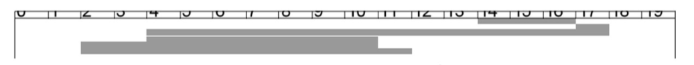

nombre total de piste parcours= (17-14)+(18-17)+(18-4)+(11-4)+(11-2)+(12-2)= 44

2. Ordonnancement suivant le plus court temps de recherche (PCTR) 根据距离的大小处理要求

    la prochaine requête traitée est celle pour laquelle le déplacement de la tête est minimal, à partir de la position courante.

    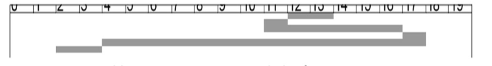

nombre total de piste parcours= (14-12)+(12-11)+(11-17)+(18-17)+(18-4)+(4-2)= 20

3. Ordonnancement par balayage
    - LOOK
    Dans la version connue sous le nom LOOK, la tête ne va pas jusqu'au bout des pistes mais repart dans l'autre sens dès qu'il n'y plus de requête en attente.

    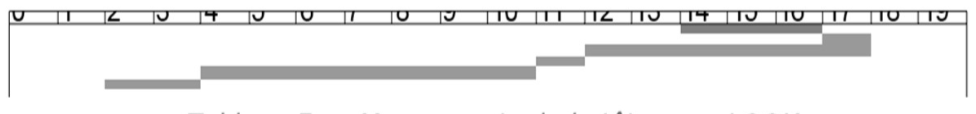

    nombre total de piste parcours= (17-14)+(18-17)+(18-12)+(12-11)+(11-4)+(4-2)= 14
    
    - SCAN
    Cet algorithme parcourt toutes les pistes dans une direction donnée, par exemple vers l'intérieur, et traite au fur et à mesure les requêtes qu'il rencontre. Ensuite, la tête change de direction et balaie toutes les pistes vers l'extérieur. Cette version de balayage est appelée SCAN

## C6. Gestion de la mémoire
### Algorithmes de remplacement de page 页面置换算法

1. Algorithme optimal 最佳置换算法（理想置换算法）
    - Remplacer la page qui ne sera pas utilisée pendant la durée la plus longue 将未来最不可能用到的页面置换掉
    - Cet algorithme suppose une connaissance de l'ensemble de la chaîne de référence; il est donc irréalisable en temps réel 这个算法要求指导所有的页面序列，因此是理想化的状态，实际上无法实现，常用衡量可实现算法的性能。

2. Ordre Chronologique de Chargement (FIFO)
    - Cet algorithme choisit comme victime la page la plus anciennement chargée.
    - simplicité de réalisation; mais n'est pas toujours bon.

    Exemple: On considère notre `séquence de référence` : 7,0,1,2,0,3,0,4,2,3,0,3,2,1,2,0,1,7,0,1
    On exécute l’algorithme de remplacement FIFO avec 3 `cadres de pages`;
    L’exécution de FIFO donne 15 `défauts de pages` pour cette séquence:

    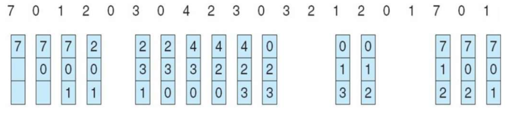   

3. Ordre Chronologique d'utilisation (LRU: Least Recently Used) 最近最久未使用算法
    
    - puisque les pages récemment utilisées ont une probabilité plus élevée que d'autres d'être utilisées dans un futur proche, une page non utilisée depuis un temps élevé a une probabilité faible d'être utilisée prochainement. 
    - L'algorithme choisit donc comme victime la page ayant fait l'objet de la référence la plus ancienne.

4. L'algorithme NRU (Not recently used)
    - Lorsqu'une page doit être libérée, une page ayant encore son bit a 0 est choisie (et si aucune n'est disponible, une page ayant son bit a 1 est alors choisie).
    - Une amélioration de cet algorithme consiste à définir quatre classes de pages comme suit :
        1. Non référencées, non modifiées. 
        2. Non référencées, modifiées.
        3. Référencées, non modifiées.
        4. Référencées, modifiées.

5. Algorithme de la seconde chance
    - une modification simple à l'algorithme FIFO afin d'éviter la suppression d'une page à laquelle on a couramment recours.
    - inspecter le bit R de la page la plus ancienne.
            - 0: la page est à la fois ancienne et inutilisée, elle est donc remplacée immédiatement.
            - 1: le bit est effacé,la page est placée à la fin de la liste d'espages

    -  il manque d'efficacité parce qu'il déplace constamment des pages dans sa liste.

6. L'algorithme de remplacement de page de l'horloge

- Example: 

    Un ordinateur possède une mémoire de 4 pages. Pour chacune des pages, le gestionnaire de mémoire tient à jour les indicateurs suivants : date de chargement, date de dernière référence, rb (bit indiquant si la page a été référencée), mb (bit indiquant si la page a été modifiée).Auninstantdonné,lasituationestlasuivante :

    Indiquer la page qu'il faudra remplacer prochainement dans le contexte de chacune des stratégies suivantes : 1) FIFO, 2) LRU, 3) NRU

    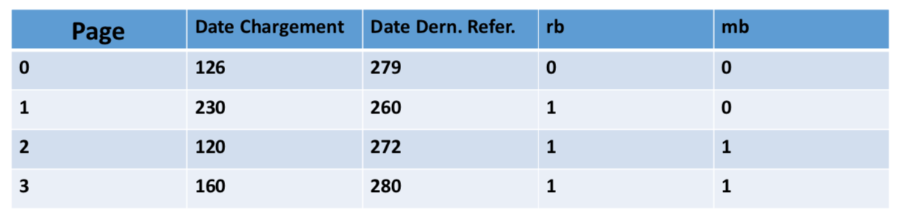

    1. FIFO: Page 2, parce que la date de chargement le plus ancienne.
    2. LRU: Page 1, parce que la date de dernière référence le plus ancienne.
    3. NRU: Page 0, parce que rb=0(non référencés) et mb=0(non modifiées)

## C8. Ordonnancement de processuss
### Algorithmes d'ordonnancement 调度算法

- Ordonnancement sans réquisition du CPU 非抢占式调度

    un processus conserve le contrôle du CPU jusqu'à ce qu'il se bloque ou qu'il se termine. Cette approche correspond aux besoins des travaux par lots (systèmes batch). Il existe plusieurs algorithmes dans cette catégorie :

    1， Premier Arrivé Premier Servi (FCFS : First Come First Served) 先来先服务算法
    
    Les tâches sont ordonnancées dans l'ordre où elles sont reçues. Le processus qui sollicite le CPU le premier sera servi le premier. On utilise une structure de file.

    La stratégie FCFS désavantage les processus courts s'ils ne sont pas exécutés en premier. 这种方法对执行所需时间很短的进程不友好，因为可能需要等待很长时间。

    Temps de traitement moyen = 2.6
    
    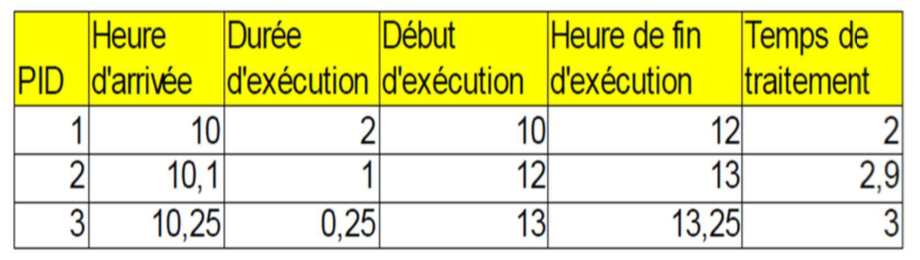

    2. Le Plus Court Job d'abord (SJF: Shortest Job First) 短服务优先

    Cet algorithme nécessite la connaissance du temps d'exécution estimé de chaque processus. Le CPU est attribué au processus dont le temps d'exécution estimé est minimal. 需要得知每个进程的执行时间

    Temps de traitement moyen = 2.38

    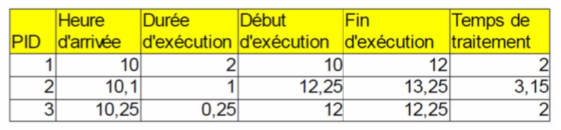

    Si tous les processus sont présents dans la file d'attente des processus prêts au moment où commence l'allocation du CPU, l'algorithme SJF minimise le temps moyen de traitement, pour l'ensemble des algorithmes sans réquisition. 
    
    Cette propriété n'est plus vrai si des processus entrent dans la file d'attente des processus prêts au cours de l'allocation du CPU.

- Ordonnancement avec réquisition du CPU 抢占式调度

    Dans cette catégorie, l'ordonnanceur peut retirer le CPU à un processus avant que ce dernier ne se bloque ou se termine afin de l'attribuer à un autre processus.
    
    1. Le temps restant le plus court (SRT : Shortest RemainingTime)
    
    la version préemptive de l'algorithme SJF. Au début de chaque quantum, le CPU est attribué au processus qui a le plus petit temps d'exécution restant.

    On prend un quantum = 1
    

    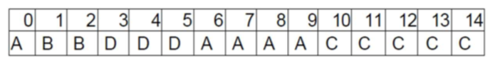

    2. Algorithme à Tourniquet (RR : Round Robin) 时间片轮转调度

    Le contrôle du CPU est attribué à chaque processus pendant une tranche de temps Q, appelée quantum, à tour de rôle.

    给每个进程固定的执行时间，根据进程到达的先后顺序让进程在单位时间片内执行，执行完成后便调度下一个进程执行，时间片轮转调度不考虑进程等待时间和执行时间，属于抢占式调度。优点是兼顾长短作业；缺点是平均等待时间较长，上下文切换较费时。适用于分时系统。

    
    

    Avec un quantum = 1 :
    temps de traitement moyen = (37+11.8+5.5) /3= 18.1

    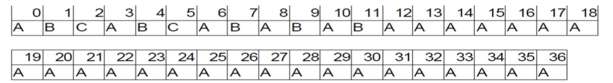

    Avec un quantum = 10 :
    temps de traitement moyen = (37+14.8+16.5) /3= 22.76

    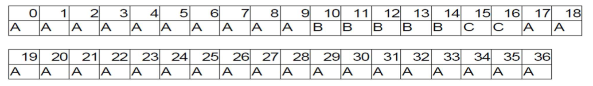
    
    3. Algorithme avec priorité 优先级调度算法

    Le CPU est attribué au processus de plus haute priorité. En cas d'égalité, l'algorithme FCFS est utilisé.

    L'ordonnancement des priorités peut être avec ou sans réquisition.

    la valeur la plus petite correspond à la priorité la plus élevée:
    

    Sans Réquisition:
    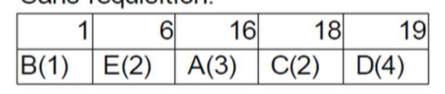

    Avec Réquisition:
    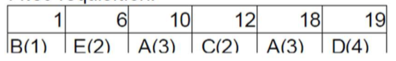

    4. Algorithme à files multi-niveaux à retour (MFQ : Multilevel Feed-back Queues) 多级反馈队列调度算法

        - Les processus demandeurs du CPU sont rangés dans N (N>=2) files F1, F2, ..., Fn. 
        - A chaque file est associé un quantum de temps Qi tel que Qi<Q{i+1}
        - Un processus entrant est inséré dans la file F1. Un processus situé en tête de la file Fi (i>1) ne sera pris en compte que si toutes les files Fj (0<j<i) sont vides
        - Si un processus pris dans la file Fi ne s'est pas terminé à la fin de son compte, il sera placé dans la file F{i+1}, sauf pour Fn où il y restera jusqu'à sa terminaison
        - un processus qui se bloque pour une E /S sera placé dans la file supérieure où il sera plus prioritaire

    将时间片轮转与优先级调度相结合，把进程按优先级分成不同的队列，先按优先级调度，优先级相同的，按时间片轮转。优点是兼顾长短作业，有较好的响应时间，可行性强，适用于各种作业环境。

##  C9. Interblockage

### Conditions néssaire d'interblockage
1. Exclusion mutuelle
2. Occupation et attente
3. Pas de réquisition
4. Attente circulaire

### Traitement de l'interblockage

1. Ignore l'interblockage

2. Prévention
    1. par prévenir l'exclusion mutuelle
    2. par prévenir l'occupation et attente
        - Allocation globale
        - Allocation par étapes
    3. par prévenir la non préemption
        - Tout processus qui demande des ressources non disponibles dans l'immédiat se bloque mais le système lui retire toutes les ressources qu'il détient déjà.
        - Si un processus demande de nouvelles ressources non disponibles le système les retire à d'autres processus bloqués en attente d'autres ressources.
    4. par prévenir l'attente circulaire: imposer un ordre total sur l'acquisition des ressources. 

3. Evitement des interblockages: 
    1. Algorithme du Banquier 
        - évaluer le risque d'interblocage pouvant être provoqué par une demande de ressource
    2. Cas d'un seul exemplaire par ressource
    

4. Détection des interblocage et reprise
    1. Cas à un seul exemplaire par type de ressource
        - Méthode : Graphe d'attente et interblocage
    2. Cas de plusieurs exemplaires par type de ressource
        - Structures de données
            1. Le vecteur DISPONIBLE
            2. Les matrices ALLOCATION et DEMANDE

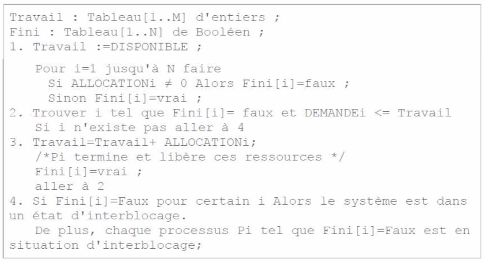

    - Défaire un interblocage 撤销死锁
        1. Terminaison de processus:
            - Avorter tous les processus en situation d'interblocage et prendre leur ressource
            - Avorter un processus à la fois, jusqu'à ce que le circuit d'interblocage soit éliminé
        2. Réquisition de ressources:
            - Réquisitionner successivement certaines ressources et les donner à d'autres processus jusqu'à ce que le circuit d'interblocage soit défait