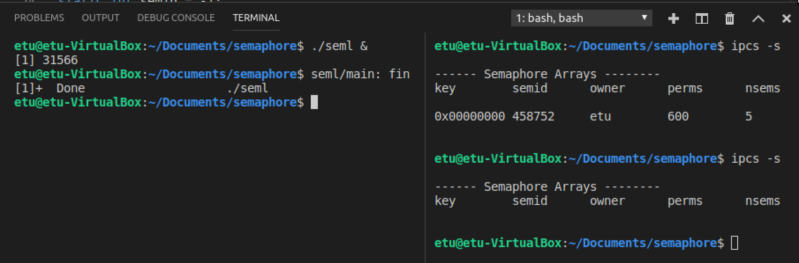

# TD6 Machine sur deux séances de 2h 

## ipcs / ipcrm

Lors de la mise au point de programmes, vous allez certainement créer des sémaphores qui ne seront pas détruits. 

Pour voir les sémaphores créés, utilisez la commande `ipcs -s`. 

Il faut penser à détruire les ressources IPC à la fin des programmes. Si cela n'est pas fait, ces ressources persistent en mémoire.

Pour détruire des sémaphores "oubliés", utilisez la commande `ipcrm -s ID`.


Vous allez avoir à inclure dans chacun de vos programmes plusieurs fichiers ".h". Il est plus simple pour ne pas en oublier de créér un fichier `semaph.h` qui contient :

```
#include <stdio.h>
#include <sys/types.h>
#include <sys/ipc.h>
#include <sys/sem.h>
...
```

Vos definitions globales puis de faire un unique `#include "semaph.h"` au début de vos programmes. 

## Ex1 - Création d'une bibliothèque P(), V()

fichers concernants: 

```
semaph.h
sem_pv.c

sem_pv.o
libsempv.a

seml.c
```

#### sem_pv.c

Les fonctions (P) et (V) sur les sémaphores n'existent pas sous cette forme. Ce premier travail a pour but de vous faire créer une bibliothèque libsempv.a contenant ces fonctions. Un programme C qui voudra ensuite utiliser ces fonctions sera "linké" avec cette bibliothèque.

Créer un programme en C `sem_pv.c` qui "implementera" les fonctions suivantes:

1. `int init_semaphore(void)`

    Crée un groupe de N_SEM sémaphores utilisables dans le processus qui fait l'appel et dans ses fils. Cette fonction devra renvoyer 0 en cas de réussite, -1 si elle a déjà été appelée, -2 en cas d'échec de création.

2. `int detruire_semaphore(void) `

    Détruit le groupe de sémaphores créé par "init_semaphore", en fin de programme. Retourne -1 si "init_semaphore" n'a pas été appelé avant, la valeur de retour de "semctl" en cas de réussite.

3. `int val_sem(int sem, int val)`

    Attribue la valeur "val" au sémaphore "sem" du groupe de sémaphores créé par "init_semaphore". Retourne la valeur de retour de "semctl" en cas de réussite, -1 si "init_semaphore" n'a pas été appelé avant, -2 si le numéro de sémaphore est incorrect.

4. `int P(int sem)`

    Réalise l'opération (P) sur le sémaphore numéro "sem" du groupe de sémaphores créé par "init_semaphore". Retourne la valeur de retour de "semop" en cas de réussite, -1 si "init_semaphore" n'a pas été appelé avant, -2 si le numéro de sémaphore est incorrect.

5. `int V(int sem)`

    Réalise l'opération (V) sur le sémaphore numéro "sem" du groupe de sémaphores créé par "init_semaphore". Retourne la valeur de retour de "semop" en cas de réussite, -1 si "init_semaphore" n'a pas été appelé avant, -2 si le numéro de sémaphore est incorrect. 

Ce programme, ainsi que tous les programmes qui, par la suite, feront appel à cette bibliothèque de
fonctions, devront faire un #include du fichier "sem_pv.h" dont le contenu est donné ci-dessous :

```
#include <stdio.h>
#include <stdlib.h>
#include <unistd.h>
#include <sys/types.h>
#include <sys/ipc.h>
#include <sys/sem.h>
#include <sys/shm.h>
#define N_SEM 5

int init_semaphore(void);
int detruire_semaphore(void);
int val_sem(int, int);
int P(int);
int V(int);
```

- Un groupe unique de `N_SEM` sémaphores est disponible pour un process et ses fils (Groupe créé avec la clé **IPC_PRIVATE**). Les sémaphores du groupe sont identifiés par un entier dont la valeur varie de 0 à N_SEM-1.

- init_semaphore() initialise tous les sémaphores à la valeur 0. Avant utilisation des sémaphores, le groupe doit être créé par appel à la fonction init_semaphore().

- Après utilisation, le groupe doit être détruit par appel à la fonction detruire_semaphore().

- En cas d'erreur, la fonction devra afficher sur "stderr" (par `fprintf(stderr, "...")`) un message explicatif avant de retourner les valeurs d'erreur (-1 ou -2). 

#### libsempv.a

``` 
# Compilez ce programme pour obtenir l'objet sem_pv.o :
$ gcc -c sem_pv.c 

# Mettez ce programme dans la bibliothèque libsempv.a
$ ar rvs libsempv.a sem_pv.o

# linker le programme avec cette bibliothèque :
$ gcc -o prog prog.c -L. libsempv.a

# lister les fonctions de la bibliothèque
$ nm -s libsempv.a
```

- La bibliothèque est créée si elle n'existait pas. 
- Si "sem_pv.o" était déjà dans la bibliothèque "libsempv.a", celui-ci est remplacé par le nouvel objet.


#### sem1.c
Créer un programme "sem1.c" qui utilise la bibliothèque précédemment créée et qui réalise les fonctions suivantes :

```
1. Appel à "init_semaphore"
2. Appel à "val_sem(2,1)"
3. Appel à "P(2)"
4. Attente de 30 secondes
5. Appel à "V(2)"
6. Appel à "detruire_semaphore"
```

- Lancez ce programme en **"arrière plan"** 
- Avant qu'il ne se termine, tapez la commande permettant de visualiser les groupes de sémaphores existants dans le système : `"ipcs -s"`

Même s'il ne fait rien d'utile, ce petit programme vous permettra de savoir si l'exécution des fonctions de la bibliothèque est correcte et ne conduit pas à des "cores". 

#### test


```
$ gcc -c seml.c
$ ar rcs libsempv.a sem_pv.o 
$ gcc -o seml seml.c -L. libsempv.a

$ ./seml &
$ ipcs -s
```

Lancez ce programme en arrière plan:


Fin du programme:



## Ex2 - Utilisation de la bibliothèque sur une section critique

fichers concernants: 

```
semaph.h
sem_pv.c

sharemem.h
sharemem.c


sem_pv.o
sharemem.o
libsempv.a

excl-mutu-none.c
```

#### sharemem.h & sharemem.c

Créer un programme `excl-mutu-none.c` qui réalise les fonctions suivantes :

```
1. Création d'un segment de mémoire partagée pouvant contenir un entier E.

2. Initialisation à 0 de l'entier E en mémoire partagée.

3. Création d'un process "fils" partageant le segment précédemment créé avec son "père". 
```

Ici on crée `sharemem.h` avec le contenu ci-dessous, et réalise les fonctions dans `sharemem.c`:

```
#include <sys/time.h>
#include <sys/ipc.h>
#include <sys/shm.h>

#include <stdio.h>
#include <stdlib.h>
#include <unistd.h>

#define SHMSZ 27

int createshm(void);
int* bindshm(int);
void initshm(int*);
```

#### main()

Chaque process (père et fils) exécute ensuite `100 fois` le code suivant, dont les quatre premières lignes constituent une section critique :

```
1. Affecter E à une variable A, entière, locale au process.
2. Attendre entre 20 et 100 ms (Utilisez les fonctions usleep(3) et rand(3V)).
3. Incrémenter A.
4. Affecter la variable locale A à la variable "partagée" E.
5. Attendre entre 20 et 100 ms (Utilisez les fonctions usleep(3) et rand(3V)).
6. Affichage dans le processus père de la valeur de E.
```

- pour générer un nombre aléatoire entre a et b en utilisant la fonction: rand(), on a:`rand()%(a-b)+b`
- **int usleep(useconds_t usec** avec unité de mesure: `us`, pour une durée entre 20 et 100 ms: `usleep((rand()%(100-20)+20)*1000)`

#### test

```
gcc -c sem_pv.c
gcc -c sharemem.c
ar rvs libsempv.a sem_pv.o sharemem.o

gcc -o excl-mutu-none excl-mutu-none.c -L. libsempv.a

./excl-mutu-none
```
 
- La valeur de la variable E est-elle égale à 200 ? Pourquoi ? 


En fait, la valeur de la variable E dans le processus père est de : 199, mais dans le processus fils est de: 200.


# TODO
- Modifiez le programme précédent (nouvelle version nommée `"excl-mutu.c"`) qui utilise la bibliothèque précédemment créée et qui permet de "synchroniser" les modifications de E par les deux process (Utilisation des primitives (P) et (V) pour réaliser une exclusion mutuelle).

## Ex3 - Utilisation de la bibliothèque pour un producteur-consommateur


fichers concernants: 

```
xxxx
```

Créer un programme `"prod-conso.c"` qui utilise la bibliothèque précédemment créée et dont le but est le
suivant :
    
- Un process fils va produire une suite d'entiers qu'il va stocker dans un buffer circulaire de taille 5 entiers.
    
- Le process père consomme les données de ce buffer circulaire.

Bien entendu, le process fils est bloqué lorsque le buffer est plein (il attend que le père consomme les données et libère de la place), et le père est bloqué losque le buffer est vide (il attend que le fils produise des données). Cette synchronisation entre le père et le fils sera réalisée uniquement à l'aide de deux sémaphores dont on aura soigneusement étudié les valeurs initiales.

**Indice**: Votre programme réalisera donc les fonctions suivantes :

- Création d'un segment de mémoire partagée pouvant contenir 5 entiers. Ce segment de mémoire
partagée sera vu comme un buffer circulaire géré par deux "index" : un index d'écriture et un
index de lecture qui évolueront "circulairement" (0 1 2 3 4 0 1 2 ...).

- Création d'un process "fils" partageant le segment précédemment créé avec son "père".

- Le process fils va jouer le rôle du producteur. Il génère les entiers de 1 à 50 qu'il stocke dans le
buffer circulaire au fur et à mesure qu'il y a de la place libre. Il gère donc l'index d'écriture du
buffer circulaire. Le process père, consommateur, va lire et afficher les données présentes dans
le buffer circulaire. Il gère l'index de lecture. 