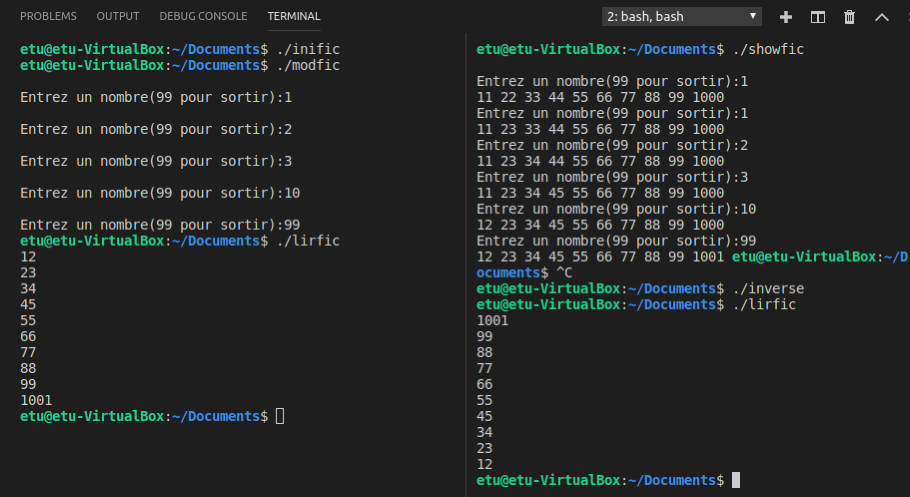

# TD4 Machine sur deux séances de 2h 

## ipcs / ipcrm

Lors de la mise au point de programmes, vous allez certainement créer des segments de mémoire
partagée qui ne seront pas détruits.

Pour voir les segments de mémoire partagée créés, utilisez la commande `ipcs -m`. Pour détruire des
segments "oubliés", utilisez la commande `ipcrm -m ID`.

Détruire les segments non utilisés: Il faut penser à détruire les ressources IPC à la fin des programmes. Si cela n'est pas fait, ces
ressources persistent en mémoire 

## ex1 (Segment de mémoire partagée : Synchronisation père-fils)

fichers concernants: 

```
sharemem.h 
surv.c
f1.dat
f2.dat
survshm.c
```


Vous allez avoir à inclure dans chacun de vos programmes plusieurs fichiers ".h". Il est plus simple,
pour ne pas en oublier, de créer un fichier "sharemem.h" qui contient :

```
#include <stdio.h>
#include <sys/types.h>
#include <sys/ipc.h>
#include <sys/shm.h>
```

Vos définitions globales puis de faire un unique #include "sharemem.h" au début de vos programmes. 

- Ecrire une fonction copiefichier(int f1, int f2) qui copie le contenu d’un fichier représenté par f1
dans un autre fichier représenté par f2. La fonction doit retourner le nombre d’octets copiés. La
taille maximale d’un bloc qu’on peut lire/écrire est de 1024 octets (#define MAXSIZE 1024).

- Ecrire un programme `surv.c` qui prend en argument deux fichiers (f1.dat et f2.dat) et surveille leurs
descripteurs de fichier en utilisant un parent et un fils : chaque processus affiche le contenu d’un
seul fichier à la sortie standard et écrit ensuite à la sortie standard le nombre total d'octets reçus. Ce
programme utilise la fonction copiefichier(int f1, int f2).

Voici un exemple d’exécution où `f1.dat` contient bonjour et `f2.dat` contient sr02 :
 
```
  $ ./ex f1.dat f2.dat
 bonjoursr02 Octes lus: 7
 Octes lus: 4
```

- Modifiez dans un programme `survshm.c` le programme surv.c pour que le parent et le fils partagent
un segment mémoire de petite taille. Le fils stocke son nombre d'octets (les octets lus à partir d’un
fichier) dans le segment de mémoire partagée. Le parent attend que le fis termine et affiche ensuite
le nombre d'octets reçus par chaque processus et la somme de ces valeurs. Le parent crée le segment
de mémoire partagée en utilisant la clé IPC_PRIVATE. La synchronisation de la mémoire partagée
est assurée par la fonction wait. Le parent n'accède pas à la mémoire partagée tant qu'il n'a pas
détecté la terminaison de son fils.

Voici un exemple d’exécution où f1.dat contient bonjour et f2.dat contient sr02 :

```
 $ ./ex2 f1.dat f2.dat
 bonjoursr02 Octes copies: 7 par le parent 4 par le fils
 11 au total 
```

## ex2  (Segment de mémoire partagée : client/serveur) 

fichers concernants: 

```
sharemem.h 
shm_client.c
shm_server.c
```

**Implémentez les programmes client et serveur suivants :**

- Client :


  1. Initialiser la taille de la mémoire partagée shmsize à 27.
  2. Initialiser la clé à 2017 (une valeur aléatoire).
  3. Créer un segment de mémoire partagée en utilisant shmget avec la clé & IPC_CREAT comme
paramètre. Si l'identificateur de mémoire partagée shmid est -1, arrêtez-le.
  4. Afficher shmid.
  5. Attacher le processus serveur à la mémoire partagée en utilisant shmmat avec shmid comme
paramètre. Si le pointeur sur la mémoire partagée n'est pas obtenu, arrêtez-le.
  6. Effacer le contenu de la région partagée à l'aide de la fonction memset.
  7. Ecrire a-z sur la mémoire partagée.
  8. Attendre que le client lit le contenu de la mémoire partagée
  9. Détacher le processus de la mémoire partagée en utilisant l'appel système shmdt.
  10. Supprimer la mémoire partagée du système en utilisant shmctl avec l'argument IPC_RMID.
  11. Arrêt 


- Serveur :

  1. Initialiser la taille de la mémoire partagée shmsize à 27.
  2. Initialiser la clé à 2017 (même valeur que dans le serveur).
  3. Obtenir l'accès au même segment de mémoire partagée à l'aide de la même clé. S'il est obtenu,
  affichez-le shmid sinon affichez le message « Le serveur n’est pas lancé ».
  4. Attacher le processus client à la mémoire partagée à l'aide shmmat avec shmid comme
  paramètre. Si le pointeur sur la mémoire partagée n'est pas obtenu, arrêtez-le.
  5. Lire le contenu de la mémoire partagée et l'imprimer.
  6. Après avoir lu, modifiez le premier caractère de la mémoire partagée en '*'
  7. Arrêt 

## ex3 Utilisation de la directive mmap()

fichers concernants: 

```
sharemem.h 
inific.c
lirfic.c
modfic.c
showfic.c
inverse.c
```

Le programme suivant écrit et lit une série d'entiers dans un fichier binaire.

```
#include <stdio.h>
#include <fcntl.h>
main() {
 int tab1[10]={11,22,33,44,55,66,77,88,99,1000};
 int tab2[10];
 int i,fd;
 fd=open("titi.dat",O_RDWR|O_CREAT|O_TRUNC,0666);
 write (fd,tab1,10*sizeof(int));
 close(fd);
 fd=open("titi.dat",O_RDWR,0666);
 read (fd,tab2,10*sizeof(int));
 close(fd);
 for (i=0;i<10;i++) printf("%d,%d\n",tab2[i],tab1[i]);
}
```

- Faites un programme `inific.c` qui initialise le fichier "titi.dat", et un programme `lirfic.c` qui imprime sur la sortie standard le contenu de "titi.dat".

- Faire un programme `modfic.c` et un programme `showfic.c` fonctionnant ainsi :
  - `modfic.c` fait un mmap() de "titi.dat", puis boucle sur la séquence suivante :

```
1. lire un nombre "i" sur stdin,
2. si on a lu "99", sortir du programme,
3. ajouter "+1" à tab1[i], dans le segment "mmap",
```

  - `showfic.c` fait un mmap() de "titi.dat", puis boucle sur la séquence suivante :

```
1. lire un nombre "i" sur stdin,
2. si on a lu "99", sortir du programme,
3. imprimer tout le tableau tab1[], lu dans le segment "mmap",
```

- Exécuter vos programmes dans deux fenêtres ("Fen1" et "Fen2"):

  - "Fen1": exécuter inific,
  - "Fen1": exécuter modfic,
  - "Fen2": exécuter showfic,
  - sortir de modfic et de showfic,
  - Fen1": exécuter lirfic. 

- Ecrire un programme qui projette un fichier en mémoire, ensuite il l’inverse (inverse son contenu) et affiche son nouveau contenu. 

