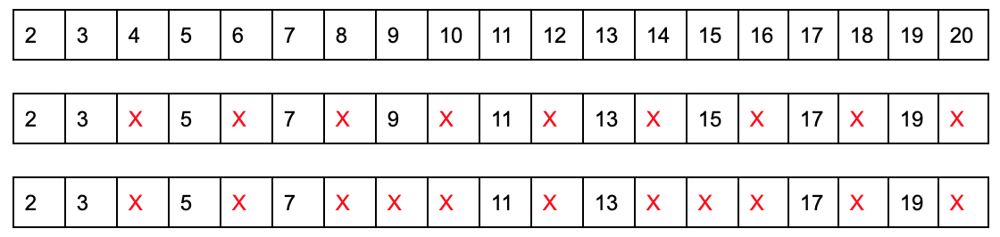
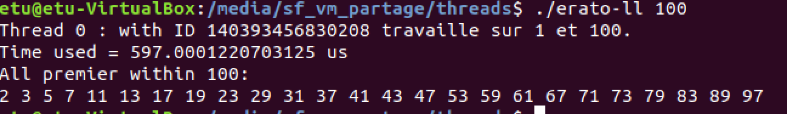
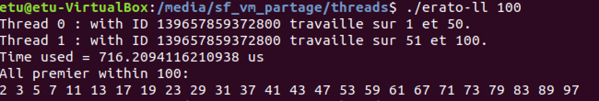
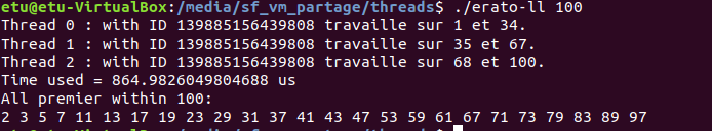
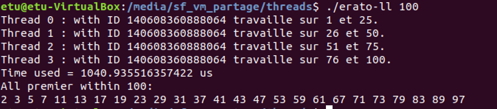
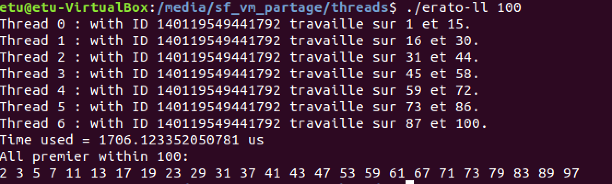
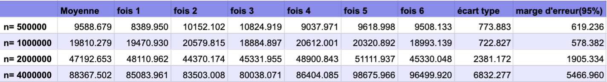
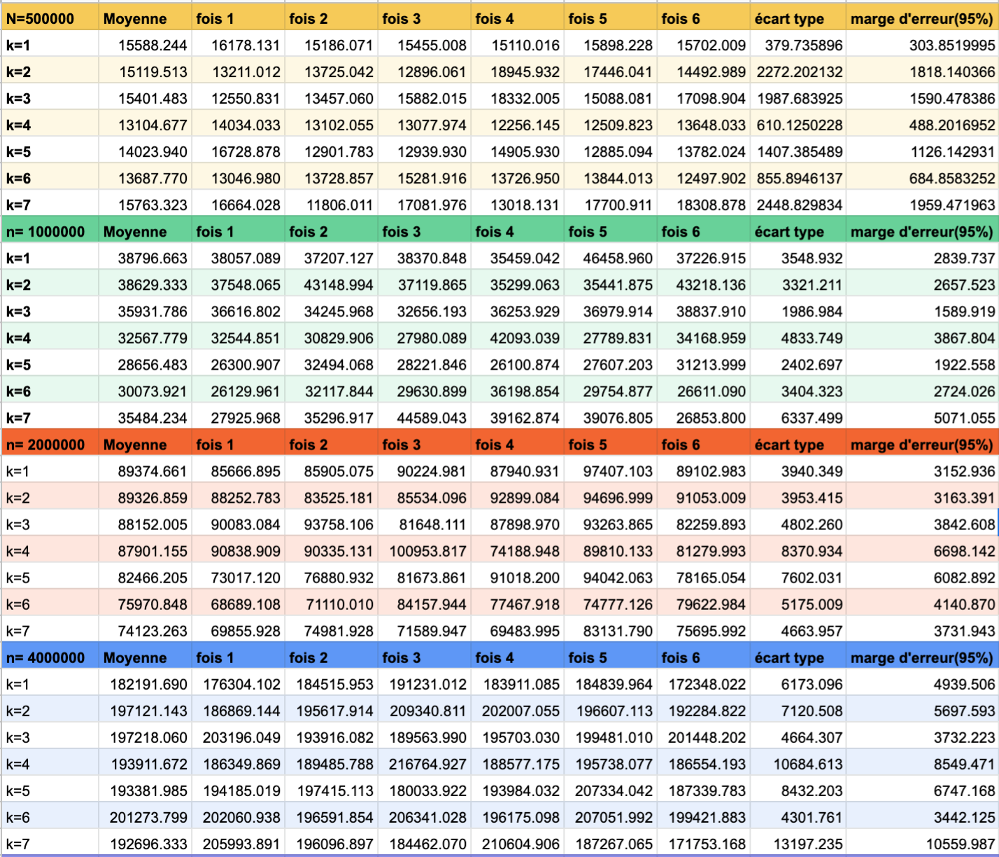
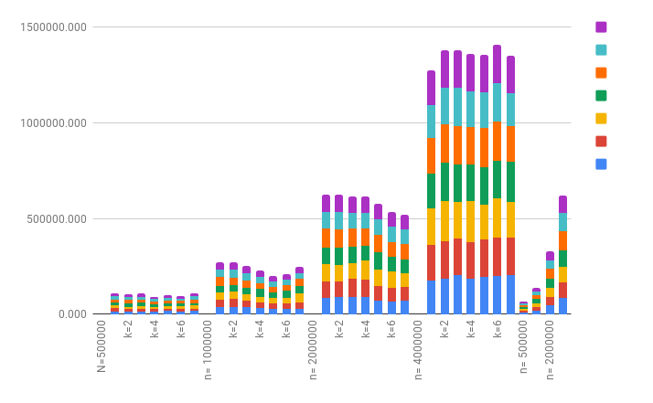
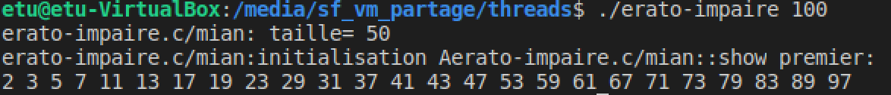

# TD8 Machine sur une séance de 2h (Threads)
Objectifs :
- Utiliser les threads POSIX
- Apprendre à paralléliser une tache en utilisant les threads

## Crible d’Eratosthenes
Le but de ce TD machine est d’implémenter une version parallèle de l’algorithme du crible d’Eratosthenes en utilisant les threads POSIX.

Tout d’abord lisez sur le crible d’Eratosthenes en suivant ce lien :
[Sieve_of_Eratosthenes](http://en.wikipedia.org/wiki/Sieve_of_Eratosthenes) et [Crible d'Ératosthène](https://fr.wikipedia.org/wiki/Crible_d%27%C3%89ratosth%C3%A8ne)

L’algorithme suivant présente une version séquentielle pour le crible d'Ératosthène :

```c
// Input: un entier n > 1
// Soit A un tableau de valeurs booléennes, indexées de 2 à n, et initialisées toutes à vrai.

for i = 2, 3, 4, ..., √n :
    si A[i] est vrai:
        for j = i2, i2+i, i2+2i, ..., n:
            A[j] := faux

// Output : Maintenant tout i telle que A[i] est vrai est un nombre premier. 
```

### Tache 1

Regardez d'abord le pseudo code ci-dessus et répondez aux questions suivantes:
- Dérouler l’exécution de cette algorithme avec n=20



Des nombres premiers entre 1 et 20 : 2, 3, 5, 7, 11, 13, 17, 19 

- Pourquoi la boucle de l’intérieure (la deuxième boucle) commence à i2 et pas 0 ou i ?
    
    Parce que de cette manière on évite de parcourir nombres qui sont multiples aussi de i-j (1<j<i)

- Pourquoi la première boucle s’exécute jusqu’à √n? Que faites-vous si √n n’est pas un entier ?

    Supposons qu’on a n qui n’est pas un prime, donc n=p*q. si p et q sont tous supérieur à √n, on a p*q supérieur à n, qui est contraire à p*q=n. Du coup, si n n’est pas prime, il existe définitivement un nombre inférieur à √n, qui peut être divisé par n.

### Tache 2

`erato-seq.c`

Comme premier étape pour votre version parallèle du programme, implémenter une version séquentielle pour le crible d'Ératosthène.

```c
for(int i = 2;i <= (int)sqrt(n);i++){
        if (A[i]==true){
            for(int j=i*i; j<=n; j+=i)
                A[j] = false
        }
    }
```

### Tache 3

`erato-ll.c`

A partir de votre version séquentielle vous allez maintenant développer une version parallèle. L'idée est de paralléliser la boucle interne du pseudo code `for j = i2 , i2+i, i2+2i, ..., n`, en distribuant l'exploration de i2, i2+i,i2+2i, ..., n sur k threads. (k est un paramètre de votre implémentation.)

Pour éviter le coût de création répétée de threads, les k threads de votre programme doivent être créés en dehors de la boucle externe des algorithmes, et être réutilisés à chaque itération de la boucle externe.

```c
/*Rappel la fonction */
int pthread_create(pthread_t *thread, const pthread_attr_t *attr, 
                   void *(*start_routine) (void *), void *arg);
```

```c
#include <pthread.h>
#include <stdio.h>
#include <stdlib.h>
#include <stdbool.h>
#include <math.h>
#include <sys/time.h>

/* nombre de thread par défault*/
#define NUM_TH 7

/* struct utilise pour passer les auguments vers thread routine */
struct th_plage {
    int num_id;
    int start;
    int end;
};


bool *A;

/* declarer des fonctions*/
void showPremier(bool* A,int n);
/* fonction exécuté dans thread*/
void* thRoutine(void* th_arg);
/* Calculer le temps d'exécution*/
double timeval_diff(struct timeval *begin, struct timeval *end);

/* MAIN */
int main(int argc, char* argv[]){
     if (argc != 2){
        printf("erato-seq.c/mian: ERROR argument needed!\n");
        exit(-1);
    }

    int n = atoi(argv[1]);

    if(n<=1){
        printf("erato-seq.c/mian: ERROR argument little than 1!\n");
        exit(-1);
    }

    /* allocation des threads et des arguments*/
    pthread_t *th_id;
    struct th_plage *th_arg;
    th_id = (pthread_t *)malloc(sizeof(pthread_t)*NUM_TH);
    th_arg = (struct th_plage *)malloc(sizeof(struct th_plage)*NUM_TH);

    /* utilisé pour confirmer le plage de chaque thread*/
    int div_result = (int) n/NUM_TH;
    int div_residu = n % NUM_TH;

    /* variables pour caluler les temps d'exécution */
    struct timeval begin;
    struct timeval end;
    
    /* Initialiser tab A */
    A = (bool *)malloc(sizeof(bool)*n);
    for(int i=2;i<n+1;i++){
        A[i] = true;
    }

    int k = 1;
    gettimeofday(&begin,NULL);
    for(int i=0;i < NUM_TH;i++){
        /* déterminer le numéro de start et le numéro de end de plage*/
        th_arg[i].num_id = i;
        th_arg[i].start = k;
        if (i < div_residu)
            k = k + div_result + 1;
        else
            k = k + div_result;
        th_arg[i].end = k-1;

        /* Threads */
        pthread_create(&th_id[i],NULL,thRoutine,(void*) &th_arg[i]);
        pthread_join(th_id[i], NULL);
    }

    gettimeofday(&end,NULL); 

    double timer = timeval_diff(&begin,&end);
    printf("Time used = %.16g us\n", timer*1000000.0);
    showPremier(A,n);
    
    free(A);
    free(th_id);
    free(th_arg);

   
    return 0;
}

double timeval_diff(struct timeval *begin, struct timeval *end){
    return 
        (double)(end->tv_sec + (double)end->tv_usec/1000000) -
        (double)(begin->tv_sec + (double)begin->tv_usec/1000000);
}

void showPremier(bool* A,int n){
    printf("All premier within %d:\n", n);
    for(int i=2;i<n+1;i++){
        if(A[i]==true){
            printf("%d ",i);
        }
    }
    printf("\n");
}

void* thRoutine(void* th_arg){
    pthread_t th_id = pthread_self();
    struct th_plage * arg;
    arg = (struct th_plage *) th_arg;
    int id = arg->num_id;
    int start = arg->start;
    int end = arg->end;

    printf("Thread %d : with ID %ld travaille sur %d et %d.\n",id,th_id,start, end);
    
    int k = 2;
    while (k*k <= end){
        int i;
        int temp;
        if(k*k < start){
            if(start%k == 0) temp = start;
            else temp = start+(k-start%k);
            for (i= temp; i <= end; i += k){
                A[i] = false;
            }
               
        }
        else 
            for(i = k*k; i <= end; i += k){
                A[i] = false;  
            }

                
        k++;
    }
    pthread_exit(NULL);

}

// gcc -pthread erato-ll.c -o erato-ll
// ./erato-ll 10

```

**Notes**:
- Il y a 2 points de synchronisation dans ce code: Les threads de travail doivent attendre que le thread principal
initialise le travail à effectuer (*); et le thread principal doit alors attendre que les threads de travail finissent
leur part du travail (**).

- Pour répartir le travail entre les threads de travail, le thread principal indique à chacun d'eux quelle plage il faut couvrir. Pour ce faire, le thread principal doit définir cette plage (comme paramètre dans la fonction creat_thread) pour chaque thread de travail avant de débloquer le thread de travail. Chaque thread doit stocker la plage qu'il doit couvrir dans les attributs appropriés.

Une fois que vous avez implémenté une version parallèle du crible d'Eratosthenes, vérifiez cette version avec différentes valeurs de k (k = 1, 2, 3, 4, 7).

- k=1

- k=2

- k=3

- k=4

- k=7


### Tache 4

L'objectif de cette dernière tâche est de comparer les performances de vos versions successives et parallèles du crible
d'Eratosthenes.

Mesurez le temps nécessaire pour calculer tous les nombres premiers ci-dessous 500,000 avec:

- Votre version séquentielle;


- Votre version parallèle avec le nombre de threads variant de 1 à 7.


Tracez les résultats sur un graphique. (Vous devriez exécuter vos expériences plusieurs fois pour obtenir des moyennes représentatives, vous saurez comment calculer un intervalle de confiance sur ces valeurs?)



Répétez la même mesure pour tous les nombres premiers inférieurs à 1 000 000; 2,000,000; 4 000 000, et dessinez les courbes correspondantes sur le même graphique. Comment interprétez-vous vos résultats?

### Tache 5

Analyser l'impact des deux optimisations suivantes :

`erato-2i.c`
- Accélérer la boucle interne: Votre boucle interne utilise un pas de i. Comment pourriez-vous le modifier pour utiliser un pas de 2i au lieu de i ? (Indice: vous devrez considérer 2 comme un cas distinct.)


`erato-impaire.c`
- Réduction de l’espace mémoire: votre implémentation utilise un tableau de Boolean (disons isPrime []) pour se souvenir quels nombres sont premiers. Cette approche utilise beaucoup d'espace: tous les nombres pairs (donc presque la moitié du tableau) sauf 2 seront mis à faux. Puisque nous savons déjà que (i) 0 et 1 ne sont pas premiers (par définition), et que (ii) tous les nombres pairs sauf 2 (i.e. 4,6,8, ...) ne sont pas premiers non plus, une approche plus efficace consiste à en utilisant un tableau qui est moitié moins grand, et en maintenant seulement un booléen pour les nombres impairs au-dessus de 3. En d'autres termes, vous pouvez utiliser isPrime
[i] pour indiquer si k = 2 * i + 3 est premier ou non.

