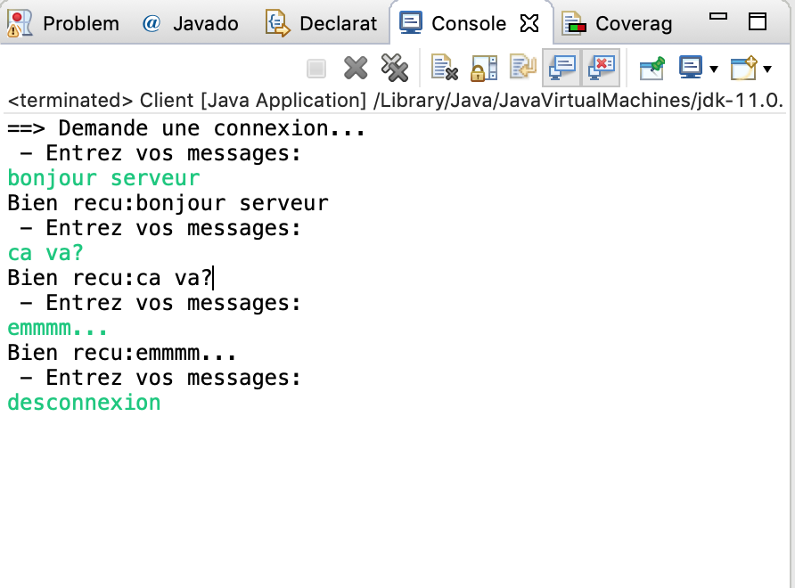

#sr03

##td1-ex: Communication Simple
- Réaliser un envoi d’un message à partir du programme Client.java en utilisant les méthodes fournies par la class OutputStream.
- Réaliser la réception du message envoyé par le client et de le visualiser sur la console à partir du programme Serveur.java.
- Envoyer une réponse au programme client.java à partir du programme Serveur.java.
- Visualiser la réponse du serveur dans le programme client.java

##td1-devoir: transfert d'un objet
- Définir une class ‘’Restaurant’’ caractérisée par un nom (de type String), un numéro de téléphone (de type String), et une position (de type ‘’Point2D ’’).

- Définir une class Serveur qui initie un tableau de restaurants et instancie un socket de connexion.
- Créer la class Client qui se connecte au serveur pour demander quel restaurant est proche d’une position communiquée via un socket.

- La class Serveur répond en envoyant un objet restaurant qui correspond à la requête client.

- Modifier la réponse de la class Serveur pour renvoyer la liste des trois restaurants les plus proches triée.