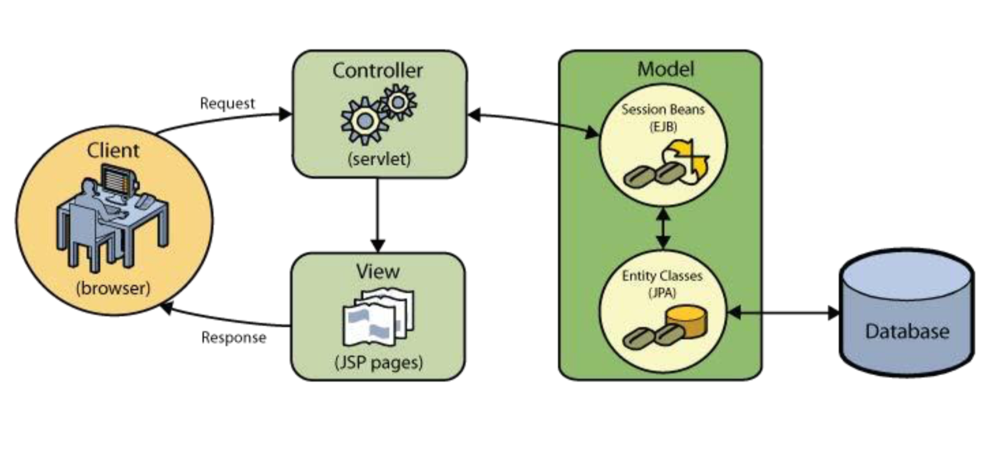
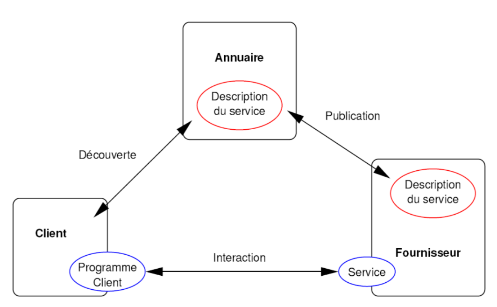

## P1:JEE et Frameworks

1. Composants JEE

    Servlet, JSP, HTML, XML

2. Conteneurs JEE

    Web Container, EJB Container

3. Connecteurs et Services JEE

    JDBC, JavaMail

4. Les avantages de l’utilisation des pages JSP par rapport à CGI, ASP et SSI

    - a. Performance, pas de nécessité d’avoir un interprète, possibilité d’utiliser les connecteurs JDBC, etc 
    - b. Portabilité
    - c. Utilisation dans des contextes réels

5. Sur quel patron d’architecture logicielle est construit React ?
    
    One-way reactive data flow

6. Citez 3 nouvelles balises HTML5 permettant d’introduire plus de sémantique dans les structures de page HTML

    nav, header, main, footer, aside, article, section

7. Considérons la commande suivante : `<jsp:setProperty property="*" name="user"/>`
    - A quoi sert-elle et où on la déclare ?
        
        La commande sert à setter toutes les propriétés d’un bean qui s’appelle « user » et on la déclare dans un JSP
    
    - Quel est son équivalent Java ?
        - Instanciation d’un bean par le constructeur() publique
        - set «attribute»(value) pour chaque propriété du bean
    
    - Qu’est-ce qu’il faut déclarer avant de cette action afin de l’utiliser correctement ? 
        
        Il faut déclarer le bean « user » : `<jsp:useBean id="user" class="classDuBeanUser" scope="session" />`

8. Considérons le message d’erreur de compilation suivant :

```
java.lang.ClassNotFoundException: com.mysql.jdbc.Driver
at org.apache.catalina.loader.WebappClassLoader.loadClass(WebappClassLoader.java:1713) at org.apache.catalina.loader.WebappClassLoader.loadClass(WebappClassLoader.java:1558)
```

<div align=center>

</div>

9. Quels sont les avantages de l’utilisation de servlets par rapport aux CGI ? Citez au moins trois.
    
    - efficacité
    - pratique (cookies, session, portabilité)
    - extensible et flexible
    - puissant et robuste(JAVA)

10. Expliquer comment communiquent les servlets entre elles ou avec une page JSP ? 
    
    Par ServeletContext.
    
11. Citer quelques objets implicites qui peuvent être utilisés en JSP. Expliquer le principe de cette utilisation. 
    
    - request: récupère le résultat de la requête 
    - session : fait référence à la session en cours
    - out : est le flux sortant
    - response : est associée à la requête

12. Quels sont les avantages et les inconvénients des Servlet JEE. Comment surmonter les inconvénients ?

    - Avantages:
        - efficacité
        - pratique (cookies, session, portabilité)
        - extensible et flexible
        - puissant et robuste(JAVA)
    - Incovénients
        - lourdeur dans une conception graphique
        - inadéquant pour la génération HTML et du code JavaScript
    

13. Examinez le code suivant :

```xml
<servlet> 
    <servlet-name>HelloWorldServlet</servlet-name> 
    <servlet-class>mypkg.HelloServlet</servlet-class>
</servlet>
<servlet-mapping> 
    <servlet-name>HelloWorldServlet</servlet-name> 
    <url-pattern>/sayhello</url-pattern>
</servlet-mapping>
```

14. Expliquer comment démarrer la servlet depuis un navigateur et où le serveur va chercher les classes pour le démarrage ?
    
    le serveur va examiner le fichier `web.xml` pour trouver les classes.

15. Expliquez la différence parmi la directive d’inclusion `<%@ include...%>` et le tag jsp `<jsp :include...>`. Dans quel moment ces deux éléments sont exécutés dans une page JSP et de quel façon ? 
    
    - directive d’inclusion: inclure le résultat d'une page HTML ou JSP dans la JSP courante. Il appartient à la directive statique. Il est exécuté au cours de l'interprétation
    - jsp:include: Includes a file at the time the page is requested. Il est une action dynamique et il est exécuté pendant l'étape de traitement des demandes.

16. Complétez le texte ci-dessous afin d’avoir une servlet qui retourne la session actuelle et compte combien de fois le site web a été accédé pendant la session actuelle ? 

```java
package mypkg;
import java.io.*;
import javax.servlet.*; import javax.servlet.http.*; import java.util.Date;

public class SessionServlet extends HttpServlet {
    @Override
    public void doGet(HttpServletRequest request, HttpServletResponse response)
    throws IOException, ServletException {
    // Définissez le type MIME du message de réponse
    ...................................................
    response.setContentType("text/html");
    // Allouez un writer pour écrire le message de réponse dans le réseau 
    ....................................................
    PrintWriter out = response.getWriter();

    // Retournez la session existante si elle existe. Créez une nouvelle session autrement. Utilisez un compteur (accessCount) pour compter combien de fois le site a été accédé pendant la session actuelle.
    .................................................... 
    .................................................... 
    ....................................................
    .................................................... 
    ....................................................
    HttpSession session = request.getSession();
    ServletContext serveletContexte = this.getServeletContext();
    if (!session){
        HttpSession session = new HttpSession();
        int accessCoun = 1;
    }else{
        int accessCount = (int)serveletContexte.getAttribute("accessCount") + 1 ;
    }
    serveletContexte.setAttribute("accessCount", accessCount);

    try {
        out.println("<!DOCTYPE html>");
        out.println("<html>");
        out.println("<head><meta http-equiv='Content-Type' content='text/html; charset=UTF-8'>"> 
        out.println("<title>Session Test Servlet</title></head><body>");
        out.println("<h2> Vous avez eu accès à ce site " + accessCount + " fois pendant cette session.</h2>"); 
        out.println("</body></html>");
        } finally {
        out.close(); }
    } 
}
```

17. Donnez une représentation graphique du model MVC, expliquez les fonctionnalités de chaque partie et décrivez-en l’implémentation JEE.


<div align=center>

</div>


<div align=center>

</div>

18. Donnez une représentation graphique de la structure d’un module web en JEE, et expliquez la position et le contenu de chaque répertoire. 


<div align=center>

</div>


19. Quels sont les 5 types d’éléments qui peuvent être contenus dans une page JSP (à part les balises HTML)?

    - Scriptlets, <% %> 
    - Expressions, <%= %> 
    - Commentaires, <%-- --%> 
    - Déclarations, <%! ... %> 
    - Directives, <%@ ... %>


20. Examinez le code suivant; Dans quel fichier est-il contenu? Comment utiliser le paramètre « annee » dans la servlet ? 

    Contient par le fichier `web.xml`. Pour utiliser le paramètre « annee » dans la servelet: `String a = getServletConfig(). getInitParameter("annee");`

```xml
<servlet> 
    <servlet-name>...</servlet-name>
    <servlet-class>...</servlet-class> 
    <init-param>
        <param-name>annee</param-name>
        <param-value>2012</param-value> 
    </init-param>
    <load-on-startup>..</load-on-startup> 
</servlet>
```
21. Quels sont les commandes nécessaires pour récupérer un objet de la session ?

```java
HttpSession session = request.getSession();
Object obj = new Object();
obj = session.getAttribute("objectname");
```

22. Montrez un exemple de déclaration et utilisation d’un JavaBean dans une page JSP.

```jsp
<jsp:useBean id="user" classe="utc.etu.UserModal" scope="session">
<%
    UserModal user = null;
    user = (UserModal)session.getAttribute("user");
    if(user==null){
        user = new UserModal();
    } 
%>
```

23. A quoi sert web.xml?

    il sert à la configurations de déploiement de l'application web(servelets mapping, resources de l'application)

24. A quoi servent HttpServletRequest et HttpServletResponse?

    `HttpServletRequest`: La requête du client est encapsulée dans un objet qui implémente l'interface HttpServletRequest, cet objet contient les données de la requête et des informations sur le client.
    `HttpServletResponse`: La réponse de la servlet est encapsulée dans un objet qui implémente l'interface HttpServletResponse


25. Comment fait une servlet pour accéder aux cookies positionnés chez le client web et pour en positionner d'autres?

```java
Cookie[] listeCookies = request.getCookies();
String name = listeCookies[0].getName();
// String value = listeCookies[0].getValue();
```

26. Comment est structurée une page JSP ? Citer les parties principales.

27. Donner les éléments essentiels contenus dans un fichier web.xml.

```xml
<?xml version="1.0" encoding="UTF-8"?>
<web-app> 
    <display-name>TestJsp</display-name> 
   <!-- Servlet -->
   <!-- Servlet mapping -->
</web-app>
```

28. Expliquer le processus de sérialisation en java.

    La sérialisation est un procédé qui permet de rendre un objet ou un graphe d'objets de la JVM persistant pour stockage ou échange et vice versa. 

    En Java, nous pouvons créer des objets de différentes manières et nous pouvons le réutiliser tant qu'il n'est pas recyclé. Cependant, les objets que nous avons créés se trouvent tous dans la mémoire de pile de la machine virtuelle et ne peuvent exister que lorsque celle-ci est en cours d'exécution. Une fois la JVM arrêtée, ces objets disparaissent.

    Mais dans des scénarios réels, nous devons conserver ces objets et les relire à tout moment. Java peut nous aider à implémenter la sérialisation.

29. Le modèle bean : pour chacune des affirmations suivantes précisez à côté si elle est correcte ou non.
    - Implémente l’interface java.io.Serializable 
        Vraie. La serialisation possible 
    - Fournit un constructeur public sans argument
        Vraie.
    - Possède des propriétés qui peuvent être modifiées lors de son déploiement
        Vraie. Via des méthodes setters.
    - Peut interroger une base de données  
        Vraie. 
    - Peut écouter des événements
        Vraie.

30. Faites un schéma des relations entre servlet, JSP et Bean.

31. Quel est l’intérêt d’une bibliothèque de tags JSTL? 
    - Simplifier la page pour la maintenance et éviter d'écrire des scriptlets sur la page
    - Réaliser l'idée de stratification
    - JSTL est une norme lancée par Sun. Elle ne dépend d'aucun framework, il suffit d'introduire le paquet jar et de le présenter dans la page.

32.  Quelle est la différence entre les méthodes jsp:forward et jsp:include? 
    - `jsp:include` - Includes a file at the time the page is requested. La page cible remplace la page d'origine et l'URL reste inchangée.
    - `jsp:forward `- Forwards the requester to a new page. La page cible est insérée dans la page d'origine et l'URL reste inchangée.

33. Listez 3 attributs principaux qui caractérisent un cookie.
    - expires(max-age): indiquer la durée de vie d'un cookie
    - domain: permet plusieur web serveur partagent un même cookie.
    - path: Spécifier la page Web associée au cookie
    - secure: type booléan pour spécifier si le cookie doit être transmis via une connexion sécurisée à la couche Socket ou pas.
    - HttpOnly: Limite la portée des cookies pour les requêtes HTTP

34. A quoi sert un cookie HTTP ? 
    
    cookie est un petit fichier texte stocké par le navigateur sur l'ordinateur de l'utilisateur qui va être envoyé aux serveurs lorsque une demande est lancé pour que les serveur identifier les différentes utilisateurs.

35. Peut-on faire fonctionner les Sessions sans passer par les Cookies ? Expliquer. 
    
    Non.

    La session utilise un schéma pour maintenir l'état côté serveur, tandis que les cookies utilisent un schéma pour maintenir l'état côté client. Mais je ne puis pas avoir une session si je désactive les cookies.
    
    Étant donné que la session utilise l'identifiant de session pour déterminer la session du serveur correspondant à la session en cours et que l'identifiant de session est transmis via le cookie, la désactivation du cookie équivaut à la perte de l'identifiant de session et la session n'est pas obtenue.

36. CGI : quels sont brièvement les avantages et les inconvénients; 
    - Avantages:
        - CGI（Common Gateway Interface）est un protocole indépendante des languages et donc peut être implémenté n'import quels languages.
        - facilité de comprendre
        - indépendance des processus
        - indépendance de l'architecture de web
    - Inconvénients:
        - Performance failbe
        - Impossible de se connecter à l'étape du traitement des autres requêtes du serveur Web.

37. Expliquer les actions numérotées dans le schéma suivant.


<div align=center>

</div>

38. Expliquer la commande suivante : getServletContext().getRequestDispatcher(urlCible).forward(req,resp);

    Faire apple d'un resource dont l'url est “urlCible” en utilisant la méthode forward pour répondre une demande. Dans le page JSP, le url ne sera pas changé.

## P2:Web Services

1. Donnez la structure du message SOAP pour invoquer le service ‹ajouter› sachant que le WSDL contient les balises suivant:

    ```xml
    <message name="insertUserService">
        <part name="nom" type="xsd:string"/>
        <part name="mail" type="xsd:string"/>
    </message>
    .........
    <message name="ajouterUserService">
        <part name="nom" type="xsd:string"/>
    </message>
    .........
    <portType name="ajouterPortType">
        <operation name="ajouter">
            <input message="insertUserService"/>
            <output message="ajouterUserService"/>
        </operation>
        ..........
    </portType>

    ```

    la structure du message SOAP:
    TODO


2. Dans un WSDL, quel est le rôle de l'élément `types`? Dans quel métalangage est-il écrit?

    `types` décrit les types utilisé. il est écrit en XML.


3. Quel(s) protocole(s) de communication est(sont) utilisé(s) par SOAP.
    
    HTTP, SMTP

4. Donner le rôle d'un namespace dans XML.

    namespace spécilise des éléments et des attribut de quelle domaines utilisé pour gérer les collision.

5. Donnez le rôle d'une description WSDL.

    la descriteur WSDL sert à: 1. décrit le type d'un service web; 2. fornit une description d'un service web indépendante du language de la plate-forme; 3.  décrit les aspects techniques d'implantation d'un service web.

6. Quelle est la solution utilisée pour découvrir et indiquer la disponnibilité d'un web service?
    
    UDDI

7. Quels sont les formats autorisés pour l’échange de données dans des services SOAP ?
    XML

8. Donnez une représentation graphique du schéma architectural de Java RMI et décrivez-en les composants. Quelle class Java faut-il étendre pour utiliser une « remote interface » ?

9. Considérons la partie suivante d’un fichier WSDL (calc.wsdl):
    - Expliquer le rôle de l’élément `types`. Quel langage doit être utilisé pour définir cet élément ?
        `types` décrit les types utilisé. il est écrit en XML.
    - Compléter les éléments manquant numérotés de (1) à (4).
        - (1): tns:calcPortType_add_Request_Soap
        - (2): tns:calcPortType_add_Response_Soap
        - (3): tns:calcPortType_sub_Request_Soap
        - (4): tns:calcPortType_sub_Response_Soap
        - `tns`: targetnamespace
    - Donner le prototype (entête) des opérations définies par ce WSDL. Justifiez votre réponse en utilisant le WSDL.
        SOAP

```xml
<definitions name="calc">
....
<types>
<schema targetNamespace="urn:calc">
... 
</schema>
</types>

<message name="addRequest"> 
    <part name="a" type="xsd:double"/> 
    <part name="b" type="xsd:double"/>
</message>

<message name="addResponse">
    <part name="result" type="xsd:double"/>
</message>

<message name="subRequest"> 
    <part name="a" type="xsd:double"/> 
    <part name="b" type="xsd:double"/>
</message>

<message name="subResponse">
    <part name="result" type="xsd:double"/> 
</message>

<portType name="calcPortType">
    <operation name="add"> 
        <input message="(1)"/> 
        <output message="(2)"/>
    </operation>
    <operation name="sub">
        <input message="(3)"/>
        <output message="(4)"/> 
    </operation>
</portType>
```

10. Quel élément est obligatoire dans une enveloppe SOAP?
    body

11. A quoi sert un Header dans une enveloppe SOAP?
    header permet la mise en place d’extensions aux mécanismes de base définis par SOAP:
    - WS-Security ajoute des entrées de signature
    - WS-RP (Routing Protocol) ajout des entrées pour le routage des messages SOAP

12. Quelle est la différence entre WSDL et SOAP?
    - SOAP est un protocole pour l’échange d’information dans un environnement décentralisé et distribués
    - WSDL est un langage descriptif d'interface placé par XML qui explique les services disponibles dans un service Web défini.
    
## P3:Socket

1. Qu’est que c’est un protocole de communication? Est-ce que « les sockets » en font partie.
    un protocole de communication est une spécification de plusieurs règles pour un type de communication particulier. Un socket réseaux est un modèle permettant la communication et la synchronisation interprocessus. Il n'est pas donc un protocole de communication.

2. De quel moyen de communication réel peut être rapproché le fonctionnement d'un échange via le protocole UDP ? et le TCP ?
    - UDP: pour des message de type de multimédia et audio
    - TCP: pour des scénario de savoir si l'autre côté a bien reçu le message, 

3. Donner les couches de l’architecture TCP/IP via un schéma. Situer les protocoles HTTP, DNS, TCP, UDP et IP dans le schéma.


4. Qu’est ce qu’une socket? A quoi servent-elles ? Citer les deux types principaux de sockets ? 
    Un socket réseaux est un modèle permettant la communication et la synchronisation interprocessus. il permet à divers processus de communiquer aussi bien sur une même machine qu’à travers un réseau. il existe deux mode de communication:
    - Mode connecté: utilise le protocole TCP. Une connexion durable est établie entre les deux processus
    - Mode non connecté: utilise le protocole UDP. il ne nécessite aucun accusé de réception.


# 总结
## P1:REST

1. Qu'est ce que c'est REST?

REST(representional state transfer): Un ensemble de principes décrivant comment les
ressources sont définies et adressées dont l'objectif est de s’appuyer sur les caractéristiques qui ont fait le succès du Web. REST n'est pas un standard, mais utilise plusieurs standards, telle que HTTP, URL, XML/HTML/GIF/JPEG, MIME Types, etc.

2. REST est-elle une architecture stateless (sans état) ou stateful (avec état) ?

Elle est stateless. Il n’y a pas de notion de session: le serveur ne se souvient pas des enchaînements des requêtes, ne fait pas varier les réponses selon un enchaînement particulier et ne stocke pas d’informations autres que les actions demandées sur les ressources (création, modification, suppression...).

3. REST utilise les URI pour nommer les ressources

4. REST permet de représente les actions sur les ressources par HTTP GET, HTTP POST, HTTP PUT, HTTP DELETE

    - HTTP GET: permet aux clients de demander une information, et puis transfère les donn.es du serveur vers client sous yne contraine représentation.
    - HTTP POST: créer une ressource
    - HTTP PUT: modifier une ressource
    - HTTP DELETE: supprimer la ressource identifié par l'URI

5. Expliquer les REST HTTP:
    - GET http://localhost/books: Récupérer tous les livres
    - GET http://localhost/books/ISBN-0011021: Récupérer le livre identifié par ISBN- 0011021
    - GET http://localhost/books/ISBN-0011021/authors: Récupérer les auteurs du livre identifié par ISBN-0011021
    - POST http://localhost/books/: Crée un nouveau livre avec les propriétées données {title, authors[], ...}
    - PUT http://localhost/books/isbn-111: Modifie le livre identifié par isbn-111 avec les propriétés soumises
    - DELETE http://localhost/books/ISBN-0011: Supprimer le livre identifié par ISBN-0011

6. Comment REST représente les données au client?
    REST représente ou retourne au client les données pour présentation par 2 formats principaux: 
    - JavaScript Object Notation(JSON)
    - XML

7. Donnez un example de règle de représentation par XML et JSON.

```xml
<course>
    <ID>CS2345</ID>
    <NAME>Une example</NAME>
</course>
``` 

```json
{course
    {id:CS2345}
    {name:Une example}
}
```

8. Qu'est-ce que c'est l'Annotation JAX-RS?

Java API for RESTful Web Services (JAX-RS), is a set if APIs to developer REST service. pour l'objectof de faciliter le développement REST web application.

9. lister les moyens pour implémenter JAX-RS.

    - [JBoss RESTeasy](http://www.jboss.org/resteasy/)
    - [Apache CXF](http://cxf.apache.org)
    - [GlassFish Jersey](https://jersey.dev.java.net/)


10. lister quelques annotation JAX-RS et expliquer leurs fonctions:

```
@PATH(YOUR_PATH)

Sets the path to base URL + /your_path. The base URL is based on your application name, the servlet and the URL pattern from the web.xml" configuration file.

@POOST/@GET/@PUT/@DELETE

Indicates that the following method will answer to a HTTP POST/GET/PUT/DELETE request


@Produces(Media Tyoe.TEXT_PLAIN[,more-types])

define which MIME type is delivered by a method annotated with @GET. In the example text ("text/plain") is produced. Other examples would be "application/xml" or "application/json".

@Consumes(type [, more-types ])

defines which MIME type is consumed by this method.

@PathParam

Used to inject values from the URL into a method parameter. This way you inject for example the ID of a resource into the method to get the correct object.
```


11. Donnez URL par le service suivant:

```java

import javax.ws.rs.GET;
import javax.ws.rs.Path;
import javax.ws.rs.PathParam; 
import javax.ws.rs.Produces; 
import javax.ws.rs.core.MediaType;

@Path("ConversionService")
public class TestRest {
    @GET 
    @Path("/InchToFeet/{i}")
    @Produces(MediaType.TEXT_XML)
    public String convertInchToFeet(@PathParam("i") int i) {
        int inch=i;
        double feet = 0;
        feet =(double) inch/12;
        return "<InchToFeetService>" + "<Inch>" + inch + "</Inch>"
        + "<Feet>" + feet + "</Feet>" + "</InchToFeetService>";
    }
}
```

URL:
```
http://localhost:8080/RestEasy/ConversionService/InchToFeet/5
```

12. Donnez quelques solutions de contrôler l'accès aux données et leurs modifications:

```
Jersey
Apache CXF
JBoss RESTEasy
```

13. Considérons le code suivant

```java
import javax.ws.rs.GET;
import javax.ws.rs.Path;
import javax.ws.rs.PathParam;
import javax.ws.rs.Produces; 
import javax.ws.rs.core.MediaType;

@Path("TemperatureService") 
public class Temp {
    @GET 
    @Path("/untruc/{i}")
    @Produces(MediaType.TEXT_XML) 
    public String convertCToF(@PathParam("i") int i) {
        double f; 
        return "<CToFService>" + "<C>" + i + "</C>"
        + "<F>" + f + "</F>" + "</CToFService>";
    }
    
    @Path("/deuxiemetruc/{f}") 
    @GET
    @Produces(MediaType.TEXT_XML)
    public String convertFToC(@PathParam("f") int f) {
        double c;
        return "<FToCService>" + "<F>" + f + "</F>"
        + "<C>" + c + "</C>"
        + "</FToCService>";
    } 
}
```

    - Donner l’URL d’invocation du service convertFToC sachant que le serveur tourne sous localhost :8081 et le web.xml contient la balise <display- name>ToTo</display-name>.

`http://localhost:8080/ToTo/TemperatureService/untruc/5`

    - A quoi sert l’annotation @Produces ?

    définir quelle type de MIME va tranférer par @GET.

## P2:Web Service

1. Donnez la définition de web service.

    Un web service est une entité qui peut échanger des documents avec le monde extérieur. Il est un programme décrit par XML, identifié par un URI et transmis par HTTP, SMTP,etc en proposant diverses fonctionnalités que d'autres programmes peuvent faire le découvert dynamiquement. Le but des web services est de fournir une architecture générale pour les applications réparties sur internet.

2. Pourquoi on a besoin d'un nouveau middleware?

    Les middlewares existants ont beaucoup de limitations:
    - protocoles de communication hétérogènes : IIOP(CORBA), RMI(JAVA), DCOM(MICROSOFT)
    - pas de d'ouverture des services
    - trop de contraintes sur le client
    - la complecité des protocoles:CORBA:IDL,Mapping
    - le prix des plate-forme
    - etc.

3. Donenz le graph de l'architecture de base de Web Service.


<div align=center>

</div>

    - le fournisseur de service : 
        - définit le service
        - publie sa description dans l’annuaire 
        - réalise les opérations
    - l’annuaire :
        - reçoit et enregistre les descriptions de services publiées par les fournisseurs
        - reçoit et répond aux recherches de services lancées par les clients
    - le client :
        - obtient la description du service grâce à l’annuaire 
        - utilise le service

4. Donnez le graph pour descrire le rôle de SOAP, WSDL et UDDI.


<div align=center>

</div>

5. Donnez un exemple de code de XML qui dexcrire un livre(avec chapitre, titre, contenu...):

```xml

<?xml version="1.0" encoding="ISO-8859-1"?>
<livre>
    <titre> le super livre </titre>
    <chapitre>
        <numero> 1 </numero>
        <titre> titre du chapitre 1 </titre>
        <contenu> blabla blabla </contenu> 
    </chapitre>
    
    <chapitre> 
        ...
    </chapitre>
<!-- suite des chapitres du livre --> 
</livre>
```

6. quels sont les 2 façons de définir une grammaire XML?
    - DTD(Data Type Definition)
    - XML Shhéma

7. À quoi servent les namespaces dans XML?
    les namespace permet d'introduire des collections de nom utilisables pour les éléments et les attributs d'un document XML pour gérer les collisions

8. Un exemple de @mail en XML Schéma:

```
XML Schéma élément
    |
    |- element
    |
    |- attribute
    |
    |- type
        | - simpleType
        | - comlexType  
```

```xml

<xsd:element name="email"> 
    <xsd:complexType>
        <xsd:sequence>
            <xsd:element name="id" type="xsd:string"/> 
            <xsd:element name="domain">
                <xsd:simpleType>
                    <xsd:restriction base="xsd:string">
                        <xsd:pattern value="(\p{IsBasicLatin})+(\.(\p{IsBasicLatin})+)+"/> 
                    </xsd:restriction>
                </xsd:simpleType> 
            </xsd:element>
        </xsd:sequence> 
    </xsd:complexType>
</xsd:element>
```

Deux autres espaces de noms fortement utilisés dans SOAP sont « xsd » et « xsi ».
- `xsd`namespace précise que les balises proviennent de la définition de schéma XML.
- `xsi` namespace indique que les balises viennent d'une instance d'un schéma XML.

9. Qu'est-ce que c'est SOAP?

    SOAP est un protocole pour l’échange d’information dans un environnement décentralisé et distribué qui est basé sur XML.

10. SOAP balise et forme générale:
    - Envelope
        - body : obligatoire, contient le message à échanger
            - Fault
                - faultcode : un code permettant d’identifier le type d’erreur
                    - Client,Server,VersionMismatch,MustUnderstand
                - faultstring : une explication en langage naturel
                - faultactor : une information identifiant l’initiateur de l’erreur
                - detail : Définition précise de l’erreur.
        - header : optionnelle, permet la mise en place d’extensions aux mécanismes de base définis par SOAP

```xml

<?xml version="1.0"?> 
<env:Envelope
    xmlns:env="http://schemas.xmlsoap.org/soap/envelope/"> 
    <env:Header>
    <!-- en-tête --> 
    </env:Header>
    <env:Body>
    <!-- corps -->
    </env:Body> 
</env:Envelope>

```

11. Qu'est-ce que c'est WSDL?
    Une description WSDL est un document XML qui décrit le type d'un service web(interface), fournit une description d'un service web indépendante du langage et de la plate-forme(types,structures de message) et décrit les aspects techiques d'implantation d'un service web(liaison).

12. Listez quelques balises XML de WSDL

    - definition
    - types: décrit les types utilisés
    - message: décrit la structure d’un message échangé
        - part: constitue le message
    - portType: décrit un ensemble d’opérations (interface d’un service web)
        - operation: décrit une opération réalisée par le service web. Une opération reçoit des messages et envois des messages.
    - binding: décrit le lien entre un protocole (soap/http) et un portType
        - transport:définit le type de transport: http://schemas.xmlsoap.org/soap/http pour utiliser SOAP/HTTP
        - style: définit la façon dont sont créés les messages SOAP de toutes les opérations
            - rpc: Encodage RPC défini par SOAP RPC
            - document: Encodage sous forme d’élément XML
    - service:  décrit un service comme un ensemble de ports
        - port: décrit un port au travers duquel il est possible d’accéder à un ensemble d’opérations. Un port référence un Binding


13. Qu'est-ce que c'est UDDI?

    UDDI(Universal Description, Discovery, and Integration) est un annuaire orienté Business permet de publier la description d’un service web et découvrir les services web disponibles

14. Listez les entités de UDDI.

    - businesses: en gros les entreprises
    - businesse services: les services fournis par les entreprises, au sens non technique du terme
    - technical models: la description abstraite des services proposés
    - service bindings : implémentation des services

15. Comment enregister un service?
    
    1. Couper en deux le fichier WSDL, en séparant la partie abstraite de la partie concrète
    2. Enregistrer la partie abstraite comme un technical model
    3. S’enregistrer comme une Business Entity
    4. Enregistrer un Business service associant la Business Entity avec le technical model

## P3: WEB Sécurité

1. Vulnérabilités fréquentes:
- Injection
- Violation de gestion d’authentification
- Violation de gestion de session
- Cross-Site Scripting (XSS)
- Violation de contrôle d’accès (références directes non sécurisées à un objet,
manque de contrôle d’accès au niveau fonctionnel)
- Mauvaise configuration sécurité
- Exposition de données sensibles
- Falsification de requête intersites (CSRF)
- Utilisation de composants avec des vulnérabilités connues
- Redirections et renvois non validés

2. Bonnes pratiques:
- Contrôler les données envoyées et reçues
- Requêtes paramétrées
- Gestion des mots de passe
- Authentification rigide
- Gestion des sessions
- Chiffrement des données sensibles
- Protection des cookies
- Protection des opérations sensibles
- Protection des répertoires
- Contrôle des redirections
- Bien configurer ses composants

## P4: JEE

1. Architecture Web: (HTML statique, HTML dynamique)


<div align=center>

</div>

2. Qu'est-ce que c'est un serveur d'application

    Un serveur d’applications est un logiciel interagissant avec une application cliente, généralement un navigateur web, en créant dynamiquement des pages web en fonction des requêtes émises par le client.

3. Listez les concepts principaux de Plate-forme JEE:
    Les Composants, les conteneurs, les connecteurs et services

4. Listez quelques composants de JEE:
    Servelets, JSP, HTML, XML

5. Qu'est-ce qu'une servelet?
    Une servelet est une class exécuté sur un serveur qui permet de la réception et le traîtement d'une requête dynamique.

6. Quels sont les avantages et des inconvénients de servelet?
    - Avantages:
        - efficacité
        - pratique (cookies, session, portabilité)
        - extensible et flexible
        - puissant et robuste(JAVA)
    - Incovénients
        - lourdeur dans une conception graphique
        - inadéquant pour la génération HTML et du code JavaScript

7. Quels sont les fonctions de `server.xml` et `web.xml`
    - server.cml    
        pour la configurations de déploiement du serveur d'Applications :context et resourcess
    - web.xml
        pour la configurations de déploiement de l'application web(servelets mapping, resources de l'application)

8. Listez les 5 types d'élément de JSP (non balise HTML)
    - Scriptlets, <% %> 
    - Expressions, <%= %> 
    - Commentaires, <%-- --%> 
    - Déclarations, <%! ... %> 
    - Directives, <%@ ... %>

9. Pour l'accès automatique aux éléments de la servlet, il existe des objets implicites utilisables depuis une JSP, listez quelques objets implicites:
    - request: récupère le résultat de la requête 
    - session : fait référence à la session en cours
    - out : est le flux sortant
    - response : est associée à la requête
    - pageContext : résume l'utilisation de fonctionnalités spécifiques au serveur
    - application : est l'objet ServletContext associé à la page
    - config : est l'objet ServletConfig associé à la page
    - exception : permet aux données d'exception d'être accessibles par la JSP designée

10. Listez les fonctions de la Directive `<%@ ... %>`
    - Directives de la Page: <%@page...%>, spécifier des paramètres pour la page (import,session...).
    - Directives d'inclusion: <%@include...%>, inclure le résultat d'une page HTML ou JSP dans la JSP courante.
    - Directives Taglib: <%@taglib...%>, permet l'utilisation de balises personnalisées.

11. Quelles sont les fonctions des actions JSP:
    Les actions JSP utilisent des constructions en XML pour contrôler le comportement du moteur de servlet. Elles sont utiles pour:
    - insérer dynamiquement un fichier
    - reutiliser des composants JavaBeans
    - rediriger l'utilisateur vers une autre page
    - générer le code HTML pour le plug-in Java
    
12. Listez quelques actions JSP:
    - jsp:include - Includes a file at the time the page is requested 
    - jsp:useBean - Finds or instantiates a JavaBean 
    - jsp:setProperty - Sets the property of a JavaBean 
    - jsp:getProperty - Inserts the property of a JavaBean into the output
    - jsp:forward - Forwards the requester to a new page 
    - jsp:plugin - Generates browser-specific code that makes an OBJECT or EMBED tag for the Java plugin
    - jsp:element - Defines XML elements dynamically. 
    - jsp:attribute - Defines dynamically defined XML element's attribute.
    - jsp:body - Defines dynamically defined XML element's body. 
    - jsp:text - Use to write template text in JSP pages and documents.
    
    - jsp:param – Spécifier des paramètres pour une autre balise (include, forward...).

13. Listez quelques attributs de jsp:useBean:
    - id : nom de l'instance du bean
    - class : nom de la classe Java
    - scope : {page|request|session|application}
    - type : type du bean (optionnel, remplace class si le JavaBean existe)
    - beanName : Nom de la classe ou de l'objet sérialisé (optionnel)

14. Quelles sont les fonctions de Taglibs.
    - identifier pour chaque balise personnalisée
    - Comme des JavaBeans, elles permettent une séparation du code Java et du code de la JSP
    - Facilitent la gestion d'une application web

15. Listez quelques bibliothèques populaires de Taglibs.
    JSTL, Taglibs de Struts, DisplayTag, Jakarta TagLib

16. Quels sont l'objectifs de filtres JSP?
    - Pour intercepter les requêtes des clients avant qu'ils accèdent à une ressource.
    - Pour manipuler les réponses de serveur avant qu'ils soient envoyés au client

17. Listez les 3 grandes briques d'un WEB générale:
    - HTML: visualiser les pages d'un web
    - URL: Repérer les objets manipulés
    - HTTP: définit le syntaxe utilisé pour les échanges entre client et serveur Web

18. Les avantages d'utilisation de JSP par rapport à CGI, ASP et SSI
    - CGI
        - La performance est nettement meilleure car JSP permet d'intégrer des éléments dynamiques dans les pages HTML au lieu d'avoir des fichiers CGI séparés.
        - Les JSP sont toujours compilées avant qu'elle soit traitée par le serveur, contrairement CGI / Perl exige que le serveur charge un interprète et le script cible chaque fois que la page est demandée.
        - Les JSP sont construites au-dessus de la Servlets Java API, donc comme Servlets, JSP a également accès à tous les puissants Java API, y compris JDBC, JNDI, EJB.
        - Les JSP peuvent être utilisés en combinaison avec des servlets qui gèrent la logique métier, le modèle pris en charge par les moteurs de template servlets Java.
        - JSP est une partie intégrante de Java EE, cela signifie que les JSP peuvent jouer un rôle dans les applications les plus simples aux plus complexes et exigeants.
    - ASP
        - la partie dynamique est écrit en Java, et non dans un langage spécifique (Visual Basic ou autres MS languages), il est plus puissant et plus facile à utiliser ;
        - il est portable vers d'autres systèmes d'exploitation et serveurs Web non-Microsoft.
    - SSI
        - SSI est vraiment conçu uniquement pour les inclusions simples, pas pour les programmes «réels» qui utilisent des données de formulaire, des raccordements de base de données

## P4: IoT

1. la définition de IoT.
    L’Internet des Objets pourrait se définir simplement comme un ensemble de réseaux d’objets physiques ou virtuels qui communiquent via des réseaux souvent sans fil à internet

2. lister quelques domaines que l'IoT permet de faire des nouvelles choses:
    - le transport
    - la santé
    - l'industrie
    - la sécurité
    - l'énergie

3. l'architexture réseau de l'IoT
    - Verticalement: comporte 4 niveaux (couches):
        1. Device Layer:
            - Gadgets.
            - Passerelles.
        2. Network Layer:
            - Accès Réseaux.
            - Prise en charge communications.
        3. Service Layer:
            - Prise en charge de services.
        4. Application Layer:
            - Prise en charge d’applications.
    
    - Horizontalement: comporte 2 niveaux  
        1. Management Layer
            - Outils de gestion pour différents niveaux.
        2. Security Layer:
            - Outils de sécurité pour différents niveaux.

4. lister les différentes plateformes de communications de device layer.
    - Courte distance:
        - RF/RFID. 
        - Bluetooth. 
        - ZigBee.
        - Z-wave.
    - Moyenne distance:
        - Xbee.
        - Wifi.
    - Longue distance:
        - LoraWan. 
        - SigFox. 
        - NB-IoT. 
        - LTE-X.

5. lister les principales fonctionnalités offertes par network layer:
    1. Les fonctionnalités Gateway
        - Découverte et Accès réseau.
    2. Routage et adressage
    3. Optimisation d’énergie
        - Fréquence d’échantillonnage. 
        - Utilisation de la radio.
    4. Prise en charge de la QoS
        - définition des Priorités.
    5. Contrôle du Flux de données
        - Régulation et fiabilité
    6. Détection des erreurs
        - Mécanisme de correction

6. lister les modules de gestion des services de service layer:
    - Service management: pour la gestion des services
    - Virtual Entity (VE): pour la gestion d’entités Virtuelles qui permet de faciliter la composition des services
    - Business process management: pour la gestion des Processus Métiers afin de créer Des services qui colle avec la stratégie Commerciale de l’entreprise

7. lister des outils composé par management layer.
    - Outil de gestion d’objets connectés. 
    - Outil de gestion de la QoS.

8. lister des outils composé par security layer.
    - Outil de gestion d’Authorizations 
    - Outil de gestion de Clés
    - Outils des autorités de Confiance 
    - Outil de gestion des identités
    - Outil de gestion d’authentification

  
9. lister les 3 paradigme de communication de l'IoT.
    1. Device-to-Device
        - communiquent directement entre eux sans passer par un serveur intermédiaire
        - passer par un réseau IP ou par un réseau Internet
        - basés souvent sur les protocoles tels que Bluetooth, Z-Wave, ou ZigBee
    2. Device-to-Cloud
        - directement à un service d’une plateforme cloud sur Internet pour échanger des données
        -  les connexions filaires Ethernet ou Wi-Fi traditionnelles pour établir une connexion entre l‘objet et le réseau IP
    3. Device-to-Gateway
        - l’objet IoT se connecte via un service ALG(Device-Application-Layer-Gateway) pour atteindre un service cloud
        - il existe un logiciel d’application fonctionnant sur une passerelle local, qui sert d’intermédiaire entre l’Objet et le service sur Cloud et assure la sécurité et d’autres fonctionnalités

10. SOA(Architecture orientée services)
    - consiste à encapsuler les applications sous forme de briques logicielles appelées services
    - pour apporter des solutions au problème d’intégration d’applications
    - favorise la réutilisation, l’évolution et l’intégration des applications

11. les protocoles pour IoT:
    - CoAP(ConstrainedApplicationProtocole): un protocole standardisé qui permet aux équipements à faibles ressources de communiquer sur des réseaux classiques tels que Internet
        - Couche Requête/Réponse: gère l’interaction avec l’application
        - Couche Messages: gère l’interfaçage avec la couche UDP via des messages asynchrone.
        - Il est possible de sécuriser les échanges de CoAP via DTLS, qui permet de faire une sécurité TLS sur un échange datagramme de UDP
    - HTTP
    - MQTT(MessageQueuingTelemetryTransport): adapté aux connexions qui intègrent une partie de mobilité entre les clients et le serveur qui va stocker les donnée
        - basé sur le mécanisme publisher/subscriber. Il est conçu pour fonctionner au dessus de TCP/IP
        - possible de sécuriser une connexion en utilisant un nom d'utilisateur et un mot de passe pour se connecter au broker ou pour l'échange de données via un protocole de sécurisation (SSL)

12. OneM2M: un Framework de conception d’application IoT orientée ressources. lister ses éléments:
    - entité
        - AE: Application Entity.
        - CSE: Common Service Entity 
        - NSE: Network Service Entity.
    - Point de référence: ensemble d’interfaces
        - Mca: interfacer AE et CSE.
        - Mcn: interfacer NSE et CSE.
        - Mcc, Mcc’: interfacer 2 CSEs.
    - Nœud: 3 types de nœuds (Entité logique): 
        - ADN: (Application Dédicated Node):AE.
        - ASN: (Application Service Node) : CSE+AE
        - MN: (Middle Node) : CSE+AE
        - IN: (infrastructure Node) : CSE+AE