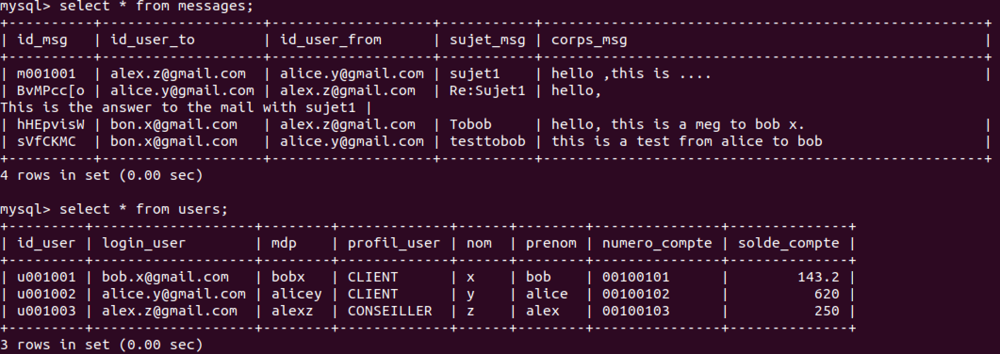
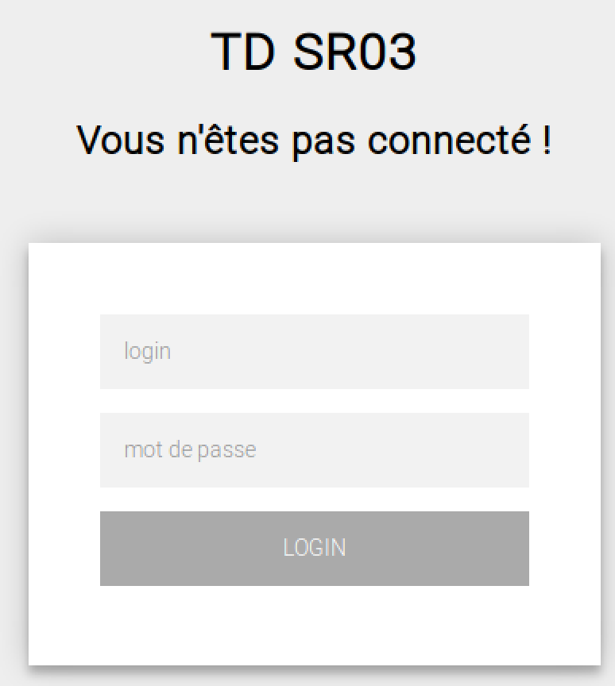
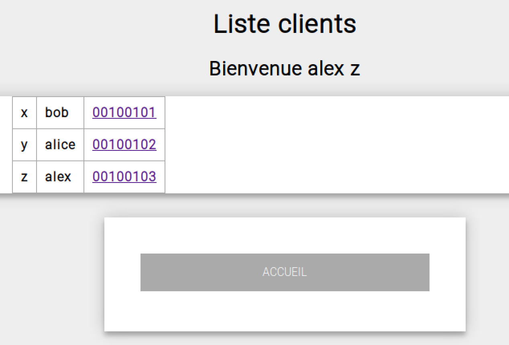
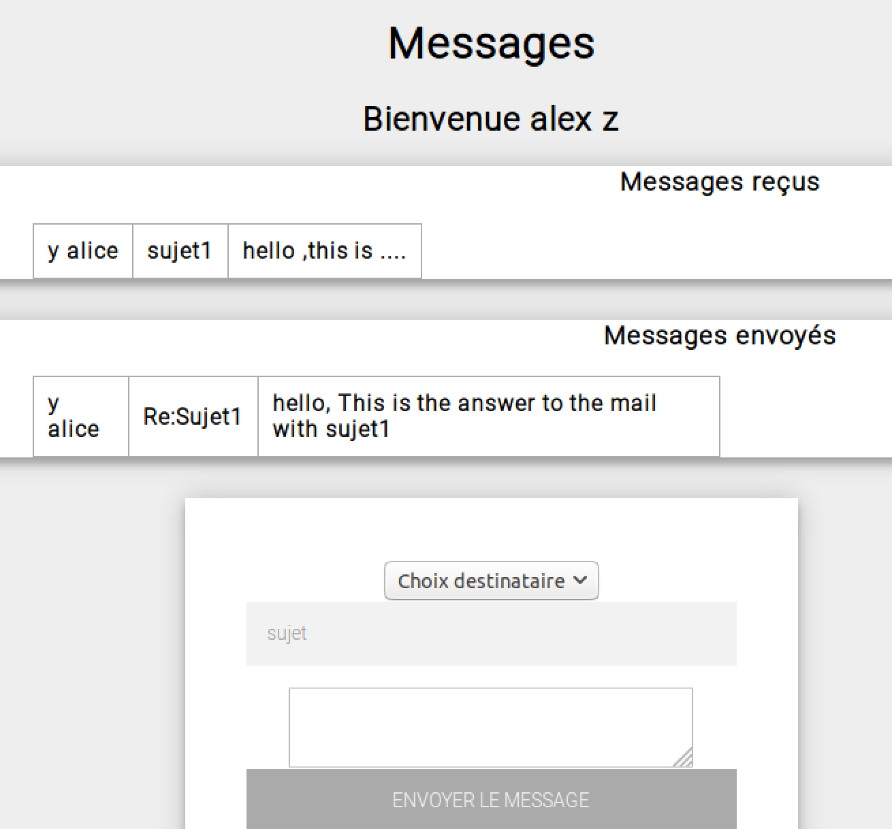
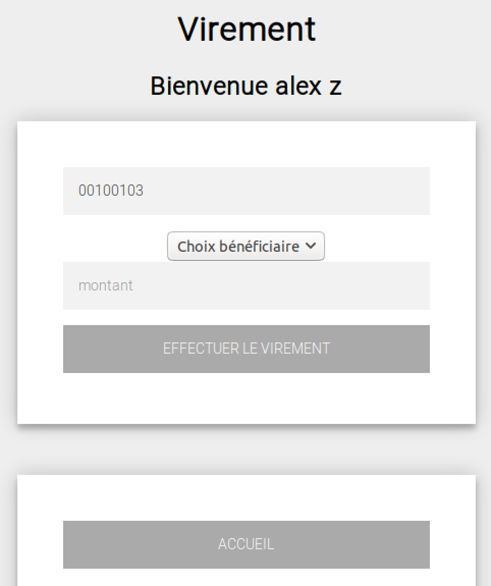

# Demande 

## Sécurité des applications web
1. Préparer un mini-projet qui servira d'étude de cas aux différents mécanismes abordés
2. Tester la vulnérabilité de votre site vis à vis de quelques exemples de failles de sécurité
3. Appliquer les correctifs nécessaires pour sécuriser votre site

### A. Votre mini site web
Vous allez mettre en place une petite application web à destination des clients et des employés d'une banque. Les pages seront développées en PHP et votre base de données sera implémentée sous MySQL.
Pour conserver l'intérêt pédagogique du TD, vous n'utiliserez aucun framework CSS, Javascript, PHP, etc...

1. Environnement de travail
Installez sur votre poste les outils nécessaires pour développer en PHP et travailler avec une base de données MySQL (ex : WAMP, LAMP, MAMP, etc...).

2. Base de données
Créez les tables suivantes :

```
- USERS :
• id_user
• login
• mot_de_passe
• profil_user ('CLIENT', 'CONSEILLER')
• nom
• prenom
• numero_compte
• solde_compte
```

```
- MESSAGES :
• id_msg
• id_user_to (identifiant du destinataire du message)
• id_user_from (identifiant de l'expéditeur du message)
• sujet_msg,
• corps_msg
```

3. Mettez en place les pages suivantes :
- `login.php`:pagecomportantleschamps'login'et'password'etunboutondeconnexion
- `accueil.php`:pagesurlaquellearriveunutilisateurquiaréussiàseconnecter;onaffichesur
cette page toutes les informations de l'utilisateur connecté; on dispose également des liens suivants sur la page : messagerie (tous les profils), effectuer un virement (tous les profils), fiche client ('CONSEILLER')
- `messagerie.php`:pagequilistetouslesmessagesreçusparl'utilisateurconnectéetqui permet de lire un message reçu ou envoyer un message
- `virement.php`:pagequipermetd'effectuerunvirement;cettepagereçoitenparamètrele numéro de compte qui sera débité
- `ficheClient.php`:pagequipermetderechercherunclientparsonnumérodecompte;quand le client est trouvé, on affiche toutes ses informations ainsi qu’un lien effectuer un virement qui appelle virement.php avec le numéro de compte de ce client en paramètre

Dans cette partie, vous ferez abstraction de l’aspect sécurisation : développez vos pages en vous souciant essentiellement de la bonne conception des fonctionnalités demandées.

### B. Etude de quelques failles de sécurité
Voici une liste de failles courantes sur les applications WEB (et présentées en cours) :

- Injection
- Cross-sitescripting(XSS)
- Violationdegestiond'authentification 
- Violationdegestiondesession
- Référencedirectenonsécurisée
- Falsificationderequête(CSRF) 
- Vulnérabilitéd'uncomposant
- Stockagenoncrypté
- AccèsauxrépertoiresparHTTP 
- Scriptsderedirection


Etudier la vulnérabilité de votre site par rapport à chacune de ces failles de sécurité. Quand cela est possible, présenter un exemple de scénario d'attaque complet (vous devrez éventuellement concevoir un faux site pirate, des mails frauduleux, etc...).

### C. Sécuriser votre site
Pour toutes les failles détectées dans la partie B, proposez un correctif en vous inspirant des bonnes pratiques de développement vues en cours.

# Réalisation

##  ENV
- Linux Ubuntu 18.04
- php 7.2.15
- mysql Ver 14.14, 
- Apache2 2.4.29

## FileTree

```
/webSecurite
  |-index.php
  |-controller/
      |-myController.php
  |-model/
      |-myModel.php
  |-public/
      |-css/
          |-mystyle.css
      |-images/
          |- logo.jpg   
  |-view/
      |-accueil.php
      |-erraction.php
      |-errauthent.php
      |-ficheClient.php
      |-login.php
      |-messagerie.php
      |-virement.php
  |-init_db.sql    # inialiser les table utilisé par la web appication.
```

### Vu d'ensemble

<div align=center>

</div>


<div align=center>

</div>

<div align=center>

</div>

<div align=center>

</div>

<div align=center>

</div>