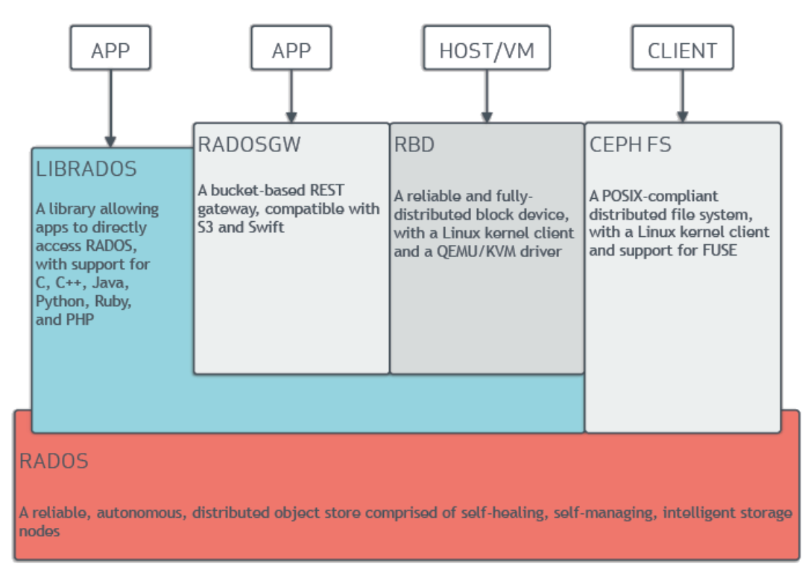
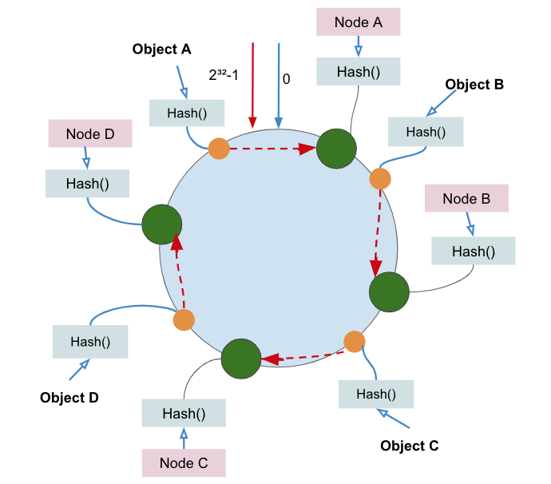
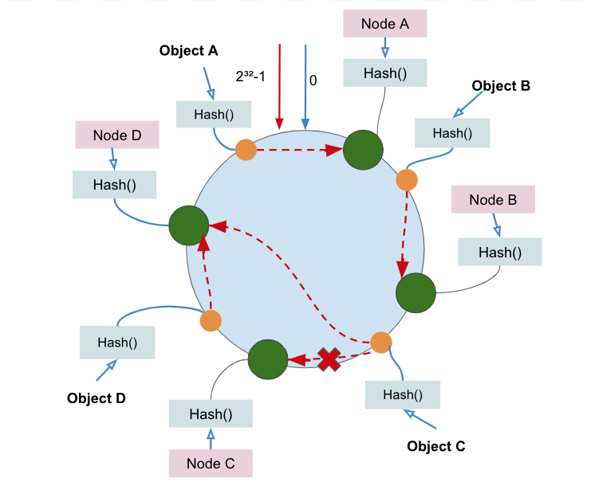
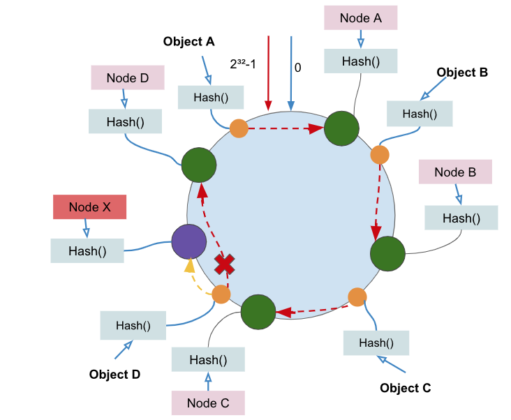
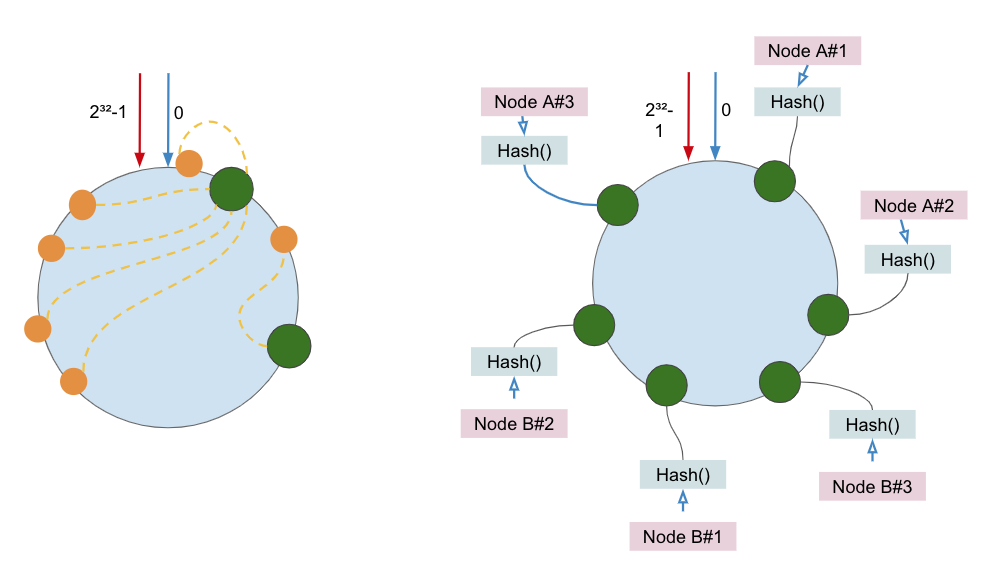
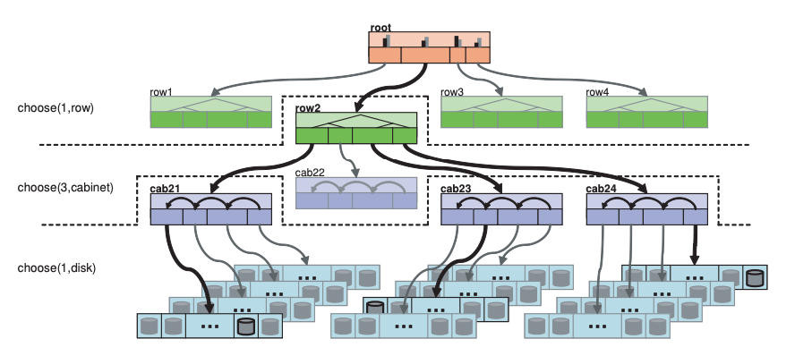
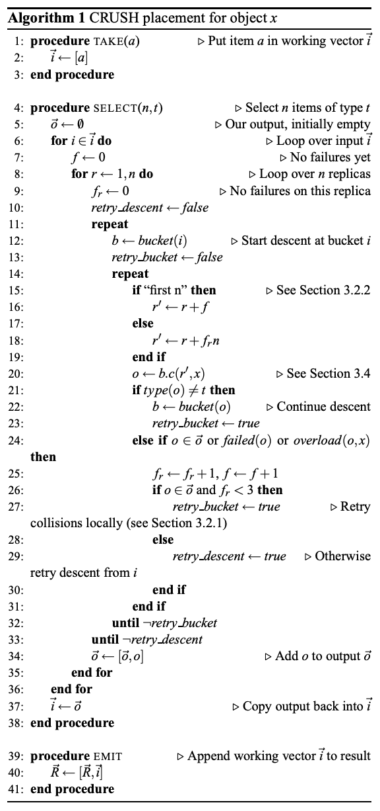

# SR05 projet ÉTUDE - ceph

### Pourquoi choisir une solution de stockage distribué ?

"Distribué" est un type d'architecture système constitué d'un ensemble de noeuds d'ordinateurs qui communiquent via un réseau et se coordonnent pour travailler ensemble afin d'accomplir des tâches communes. L'apparition des systèmes distribués a permis d'effectuer des tâches de calcul et de stockage qui ne peuvent pas être effectuées par un seul ordinateur. Un des objectifs du stockage distribué est d'utiliser plus de machines pour stocker plus de données. 

Les systèmes distribués se développent en se basant sur le systèmes centralisés. Mais le concept des deux systèmes est complètement opposé. Un système centralisé est une architecture qui distribue tous les programmes et fonctions à une machine unique pour fournir des services. Elle est facile à maintenir, cependant les inconvénients sont également évidents. Si la machine centrale tombe en panne, le système entier cesse de fonctionner. 

Éviter la vulnérabilité d'un seul noeud dans le système centralisé n'est qu'une des raisons pour utiliser le système distribué. Une autre raison importante est l'extensibilité. Après tout, toutes les machines (même un super-ordinateur) auront des limites de performance. Cependant, les systèmes distribués peuvent être améliorés horizontalement en augmentant le nombre de machines. 

Avec l'avènement de l'ère Internet, la quantité de données à stocker a augmenté de façon importante. Traiter des demandes simultanées élevées et des données volumineuses devient un problème urgent en entreprise. Dans le même temps, les exigences des applications d'entreprise changent souvent avec le temps, ce qui impose également des exigences élevées aux plates-formes d'applications d'entreprise. La flexibilité des services proposés par le système distribué est donc l'avantage principal pour l'adaptation des entreprises aux changements des demandes. Celui-ci est aussi le moteur du développement du système distribué.

De plus, les solutions de stockage distribués sont également l'opportunité d'avoir une gestion de sauvegarde des fichiers d'un noeud sur ses noeuds voisins.

### Diverses solutions de système de stockage distribué

- `AFS (Andrew File System)` qui est inspiré par NFS (Network File System). Les différentes unités de stockage du réseau sont montées dans un répertoire commun. C'est le premier système de stockage distribué réalisé par CMU et IBM en 1982.
- `HDFS (Hadoop Distributed File System)` qui est inspiré par la publication de MapReduce, GoogleFS et BigTable de Google. 
- `GlusterFS` est un système de fichiers libre distribué en parallèle, qui permet de stocker jusqu’à plusieurs péta-octets ($10^{15}$octets). C’est un système de fichiers de grappe de serveurs.
-  `Lustre` est un système de fichiers distribué libre, généralement utilisé pour de très grandes grappes de serveurs. Le nom provient de la fusion entre les mots Linux et Cluster. Il est maintenant développé, distribué et maintenu par Sun Microsystems.
-  `Swift` est un service sous openstack qui permet de créer et gérer des espaces de stockage objet en ligne. Ce service est stable et sûr d’utilisation. Il permet de stocker des fichiers de très grande capacité et accessibles de manière instantanée. Swift permet le stockage objet persistant, sécurisé, redondant, connecté directement à internet sans instance de serveur, sans contrainte de réservation d’espace.
-  `Moose` est un système de fichiers distribué développé par Gemius SA. MooseFS se veut tolérant aux pannes, redimensionnable, compatible POSIX, et générique. Il suit en grande partie les mêmes concepts que Google File System, Lustre ou Ceph. Le code préalablement propriétaire a été libéré et mis à disposition publiquement le 5 mai 2008.


### Introduction Ceph



La couche sous-jacente de Ceph est RADOS (Reliable Autonomic Distributed Object Store), qui est aussi un système de stockage distribué. RADOS expose l'interface d'appel ‹LIBRADOS› au monde extérieur, il ne suffit que d'appeler l'interface LIBRADOS pour manipuler Ceph. Les fonctions de stockage de Ceph sont basées sur RADOS. RADOSGM (Rados Rest Gateway) est utilisé pour le stockage d'objets; RBD (Rados Block Devices) pour le stockage de blocs; CephFS (Ceph FileSystem) est un programme en mode noyau qui fournit une interface POSIX au monde extérieur.


L'unité de base de fonctionnement de Ceph est un noeud. Un noeud de Ceph exploite le matériel standard et les démons intelligents. Un grand nombre de noeuds fournit un cluster de stockage de Ceph. Les noeuds communiquent entre eux pour répliquer et redistribuer les données de manière dynamique. Un cluster de stockage de Ceph contient quatre types de noeuds: Ceph monitor, Ceph OSD Daemon, Ceph Manager et Ceph MetaDate Server.

Dans le système distribué de stockage, comment on applique des règles de la distribution des données et de l'adressage des données est toujours un sujet de préoccupation. Normalement, tous les rôles (serveurs, clients) dans le système respectent un algorithme unitaire pour réaliser ses fonctions.

Tout d'abord, la résolution est de maintenir une table (key-value) globale. Il suffit que les rôles consultent la table globale lors de la manipulation des données. Cependant, avec l'augmentation de la quantité des données et l'élargissement de la taille de cluster, il devient de plus en plus difficile de maintenir une table globale. L'algorithme CRUSH est destiné de résoudre cette problématique. CRUSH n'a pas besoin que des informations et des règles prédéfinies qui décrivent l'architecture physique de cluster (conclus dans CRUSH map) pour réaliser la fonction de l'adressage des données.

Quant à la distribution des données dans le système distribué, il faut généralement considérer les 3 facteurs ci-dessous :

- L'isolation des domaines de défaillance. Les réplications d'une même données doivent être distribuées dans des différents domaines de défaillance pour réduire le risque de la détérioration des données.
- La répartition de charge. C'est à dire que des données sont distribués uniformément parmi des noeuds de stockage pour éviter le surcharge ou l'oisiveté des noeuds, qui affectera la performance du système.
- Le contrôle de la quantité de la migration des données lors de la modification (l'ajout ou la suppression) d'un nouveau noeud. Le meilleur cas est que lors de la modification d'un noeud, seul les données situées dans ce noeud vont être migrées vers les autres noeuds, et des données sur les noeuds normaux ne vont pas faire la migration.

####OSD (Object Storage Daemon)}

Les OSDs servent au stockage de toutes les données et objets du cluster. Ils permettent de dater la réplication, la récupération, le renvoi et le rééquilibrage des données du cluster. Un OSD peut envoyer des pulsations aux autres démons OSD, et fournir des informations de surveillance à monitor.

Au lieu d'une table de consultation centrale, les client du cluster de stockage et chaque Ceph OSD utilisent l'algorithme CRUSH pour calculer efficacement les informations sur l'emplacement des données.

#### MON (Monitor)
Un Ceph monitor conserve une master copie du cluster Map. Le Cluster Map décrit les OSDs inclus dans le cluster de stockage et la distribution de toutes les données. Un cluster de Ceph monitors garantit une haute disponibilité en cas d'échec d'un démon de monitor. Les clients du cluster de stockage récupèrent une copie de la carte du cluster de Ceph Monitor. Autrement dit, le client se connecte d'abord à Monitor par TCP, obtient le Cluster Map et effectue des calculs sur le client. Une fois l'emplacement de l'objet connu, il communiquera directement avec l'OSD (décentralisée).

#### MGR (Manager)

Le Ceph Manager travaille avec le Ceph Monitor pour fournir une surveillance ainsi que des interfaces supplémentaires aux systèmes de surveillance et de gestion externes. Après la version 12.x(luminous), Un Ceph Manager est obligatoire pour le système.


#### MDS (MetaData Server)
Le Ceph MetaDate Server n'est généralement pas nécessaire, car il n'est pas requis qu'on utilise CephFS. Il peut maintenir les informations de fichiers dans le CephFS et les fournit aux CephFS clients. Avec ce serveur, pour les commandes qui ne manipule pas les données de fichiers dans CephFS, par exemple ls, il n'y aura pas de coût pour le cluster. Toutes les informations nécessaires sont déjà stockées dans MDS.

#### Pool et PGs (Placement Groups)
Un cluster de stockage de Ceph peut être divisé en plusieurs pools. Chaque pool isole entre eux mutuellement et logiquement. Les différents pools peuvent avoir des méthodes de traitement des données complètement différentes, telles que le nombre de PGs, la taille de réplique et les règles CRUSH.

Dans Ceph, PG (Placement Group) est une notion logique. Elle est similaire à l'index de la base de données lorsque les données sont adressées : chaque objet Ceph est associé de manière fixe dans une PG. Lors de la recherche d'un objet, il suffit de rechercher la PG à laquelle appartient l'objet, puis la parcourir. Dans ce cas, il n'est pas nécessaire de parcourir tous les objets. De plus, PG est également utilisé comme unité de base pour la migration.

Comme nous avons dit, la PG permet d'organiser et cartographier le stockage d'objet. En effet, une PG est responsable de l'organisation de plusieurs objets (milliers, voire davantage), mais un objet ne peut être associé qu'à une seul PG. La correspondance entre la PG et l'objet est “un à plusieurs”. En plus, une PG sera associé sur $N$ OSDs et chaque OSD comportera un grand nombre de PG. C'est à dire la correspondance “plusieurs à plusieurs” entre la PG et l'OSD.

#### RBD (RADOS Block Devices)}

Dans les systèmes Unix ou Linux, il y a deux types de périphériques : le périphérique en caractère et le périphérique en bloc. Un périphérique en caractère se présente souvent comme un appareil d'entrée ou de sortie. Un bloc est une séquence d'octets (par exemple, un bloc de données de 512 octets). Il peut se présenter en forme d'image. Les interfaces de stockage basées sur des blocs constituent le moyen le plus courant de stocker des données sur des supports en rotation tels que des disques durs, des CD, des disquettes et même des bandes traditionnelles à 9 pistes. L'omniprésence des interfaces de périphériques en blocs fait d'un périphérique en bloc virtuel un candidat idéal pour interagir avec un système de stockage de données de masse comme Ceph.

Ceph RBD interfaces utilisent aussi le système de stockage d'objet (OSD) qui fournit l'interface de librados et le système de fichier CephFS. Ceph RBD sauvegarde les images de bloc comme objets dans OSD. Grâce à librados, RBD hérite les capacités de librados, par exemple, le snapshot, la récupération de snapshot.

En plus, Ceph peut diviser des images pour plusieurs noeuds dans un cluster. Cela va beaucoup améliorer la performance d'accès de l'image large.


#### RGW (Rados gateway)}

Rados Gateway est une interface de stockage d'objets construite sur librados pour fournir aux applications avec une RESTful gateway vers les clusters Rados. Il prend en charge deux interfaces:

-  S3-compatible : Fournit une fonctionnalité de stockage en mode bloc avec une interface compatible avec un grand sous-ensemble de Amazon S3 RESTful API.

-  Swift-compatible: Fournit une fonctionnalité de stockage en mode bloc avec une interface compatible avec un grand sous-ensemble de OpenStack Swift API.


Rados Gateway est un module FastCGI permettant d'interagir avec librados. Puisqu'il fournit des interfaces compatibles avec OpenStack Swift et Amazon S3, Rados Gateway dispose de sa propre gestion d'utilisateurs. Rados Gateway peut stocker des données dans le même cluster Rados que celui utilisé pour stocker les données de CephFS client ou Rados Block Devices. Les API S3 et Swift partagent un espace de noms commun. Nous pouvons donc écrire des données avec une API et les récupérer avec l'autre. Rados Gateway n'utilise pas CephFS metadata server. 


####  CephFS (Ceph FileSystem)
CephFS est un système de fichiers distribué conforme à POSIX et construit sur la grappe de serveurs (cluster) Ceph. Il utilise le même Ceph Storage Cluster système que Ceph Block Devices, Ceph Object Gateway ou librados API. 


### Hash Uniforme

L'algorithme de Hachage uniforme organise l'intégralité de l'espace de hachage en anneau virtuel. Différent de l'algorithme de Hachage simple, on suppose que la valeur de l'espace d'un hachage H est entre 0 et \(2^{32}-1\).

Ensuite, à l'aide de hachage, nous pouvons choisir l'adresse IP ou le nom d'hôte d'un serveur comme clé de hachage afin de déterminer sa position sur l'anneau de hachage. Supposons que nous avons 4 serveurs (Node A, Node B, Node C, Node D) et 4 objets de données(Objet A, Objet B, Objet C, Objet D), tels que leurs positions dans l'anneau de hachage soient identique à la figure ci-dessous:



En fonction de l'algorithme de Hachage, l'objet A sera attribué au noeud A, l'objet B sera attribué au noeud B, l'objet C sera attribué au noeud C et l'objet D sera attribué au noeud D.

#### La tolérance de faute et l'extensibilité de Hachage

Supposons que le noeud C est échoué, on peut voir que les objets A, B et D ne sont pas affectés et que seul l'objet C est déplacé vers le noeud D. 

En générale, si un serveur devient indisponible, les données affectées ne sont qu'entre le serveur indisponible et le serveur précédent (le premier serveur rencontré dans le sens inverse des aiguilles d'une montre). Les données sur les autres serveurs ne sont pas affectées.



Supposons qu'on ajoute un serveur (Node X) dans l'anneau de hachage. On peut constater que seul l'objet C a besoin de déplacer vers le nouveau noeud X.

En général, en cas d'ajout d'un nouveau serveur dans l'algorithme Hachage, les données affectées ne sont qu'entre le nouveau serveur et le serveur précédant (le premier serveur rencontré dans le sens inverse des aiguilles d'une montre).

#### Problème d'asymétrie des données dans l'anneau de hachage

Lorsque le nombre de serveur est petit, il est facile de générer un déséquilibre des données en raison d'une division inégale. C'est à dire, la majorité des objets stockés est placée sur un serveur. Comme montré dans la figure ci-dessous :



Une grande quantité de données est concentrée sur le noeud A et une petite quantité sur le noeud B en même temps. Dans ce cas, si le noeud A est échoué, le calcul et le déplacement des données seront énorme. Pour résoudre ce problème, l'algorithme Hachage ajoute le mécanisme de noeud virtuel. C'est à dire qu'il calcule plusieurs hachages pour chaque noeud physique et met un noeud virtuel dans les positions correspondantes aux résultat de calcul, appelé aussi un noeud de service.  

Par exemple, pour la situation précédante, on calcule 3 noeuds virtuels pour chaque noeud physique : NodeA\#1, NodeA\#2, NodeA\#3, NodeB\#1, NodeB\#2, NodeB\#3; pour former 6 noeuds virtuels.



Dans le même temps, l'algorithme de positionnement des données n'a pas changé, mais il n'y a qu'une étape pour mapper le noeud virtuel sur le noeud physique. Dans les applications réelles, le nombre de noeud virtuel est généralement fixé à 32 ou plus, de sorte que même un petit nombre de noeuds physique peut réaliser une distribution de données relativement uniforme.

#### Hachage dans Ceph

Pour le placement des objets, Ceph utilise l'algorithme CRUSH, qui est basé sur l'algorithme Hachage. La PG de CRUSH est précisément le noeud virtuel dans l'algorithme de hachage uniforme en fixant le nombre de noeud virtuel (PG). Cependant, afin de trouver un OSD pour placer les objets, Ceph a besoins de 2 étapes principales :

-  Obtenir l'identificateur de PG `PGID=HASH(OBJID)% PGNOMBRE `
-  Mapper de PG (noeud virtuel) et de noeud physique

###  [Algorithme CRUSH](https://ceph.com/wp-content/uploads/2016/08/weil-crush-sc06.pdf)

Comme dit précédement, l'objectif de l'algorithme CRUSH est d'obtenir une liste des OSDs : 

```    
CRUSH(PGID)=[OSD_1,OSD_2,OSD_3,...] 
``` 

Ceph décrit toutes ses ressources matérielles du système comme une architecture arborescente, et puis génère une arborescence logique sous la forme de cluster Map conformément à certaines règles de tolérance aux pannes basées sur cette structure.

Supposons une structure comme celle indiquée dans la figure ci-dessous : Les bandes bleus en bas peuvent être vues comme des serveurs; les cylindres à l'intérieur comme des OSDs; les bandes violettes comme des cabinets (armoires) qui contiennent plusieurs serveurs; les bandes vertes comme une rangée de cabinet et la bande orange comme la racine de la structure dans le sens pratique. 



Dans Ceph, toutes les bandes sont vues en tant qu'un noeud. Et généralement, Ceph considère deux type de noeuds.


-  Bucket : tous les noeuds logiques. Dans Ceph, un bucket est l'unité de domaine de l'isolation de défaillance. Par exemple, supposons que tous les cabinets ne partagent pas de circuit électrique, si l'alimentation d'un cabinet est en panne, il ne va pas affecter des autres cabinets. 
-  OSDs : un OSD est un noeud de type réel. En général, un OSD n'est pas utilisé pour un domaine de l'isolation de défaillance.


#### Cluster Map

Cluter Map est composée de périphériques et de buckets, qui possèdent des descriptions des données et des poids. Un buckets peut contenir plusieurs périphériques ou d'autres buckets, cela lui permet de fournir une structure hiérarchique de stockage. 

Les contenus de Cluster Map comprennent :

-  Epoch : le numéro de la version qui est une séquence croissante monotone. Plus l'Epoch est élevé, plus la version de CRUSH Map est récente. Ce mécanisme permet de comparer les différentes versions contenues par les OSDs ou les Clients pour déterminer la version qui doit être respectée. Autrement dit, lorsque la différence de valeur de l'Epoch des deux parties pendant la communication, il faut d'abord synchroniser la version de CRUSH Map la plus récente par défaut, puis les opérations suivante sont effectués.

-  Les adressages réseaux des OSDs.

-  L'état des OSDs. L'état des OSDs considère deux dimensions : si l'OSD travail normalement(up/down) et si l'OSD est contenu dans au moins un PG (in/out). Du coup, chaque OSD a quatre états possibles. 

    - up et in : cela indique que l'OSD fonctionne normalement et qu'il a déjà été contient dans au moins un PG.
    
    - up et out : cela indique que l'OSD fonctionne normalement mais qu'il n'est pas contient par un PG.
    
    - down et in : cela indique la fonctionnement anormale de l'OSD qui stocke des données.
    
    - down et out : cela indique l'OSD a complètement échoué et ne comporte plus de PG.

-  Les paramètres de configuration de l'algorithme CRUSH. Il montre la hiérarchie du Cluster Ceph et les règles d'emplacement.




#### Le processus

Comme dit précédemment, la couche sous-jacente de Ceph est RADOS, qui est destinée au stockage des objets. Du coup, toutes les données vont d'abord être divisées en plusieurs objets en fonction d'une taille fixé (4M par défaut). Chaque objet possède un identifiant (oid) qui respecte les règles de nomination. Avec l'identifiant de l'objet, Ceph peut ensuite calculer l'identifiant de PG pour obtenir le pgid. Et puis lister une table des OSDs pour exécuter l'algorithme CRUSH. Suivant il faut filtrer les OSDs afin de trouver les OSDs satisfaits des demandes requises. Par exemple, les OSDs doivent marcher normalement. Finalement, le client déclenche une demande au premier OSD dans la table qui va faire le traitement correspondant. En résumé, la fonctionnement de l'algorithme CRUSH est d'obtenir une table des OSDs (avec un OSD primaire et d'autres OSDs de répliquât).


L'algorithme CRUSH calcule la distribution des objets de données en fonction du poids de chaque machine. La distribution des objets est déterminée par le Cluster Map et la stratégie de distribution des données. Cluster Map décrit les ressources de stockage disponibles et la hiérarchie telle que le nombre de racks, le nombre de serveurs dans chaque racks et le nombre de disques sur chaque serveur. La stratégie de distribution des données consiste en des règles d'emplacement, qui détermine le nombre de copie de chaque objet de données et les limites de ces copies stockées. Par exemple, 3 copies sont placées dans des racks différents. Cela permet de réaliser l'isolation des domaines de défaillance parce que les 3 copies ne partagent pas un même circuit physique.


#### Fonction SELECT


Un exemple de règle de Ceph conformément à la figure 11 :
```
take(root)
select(1,row)
select(3,cabinet)
select(1,osd)
```

Le but de la fonction SELECT est d'élire $n$ buckets parmi les noeuds fils du bucket courant dans l'arborescence. En effet, rappelons que le but de l'algorithme est de parcourir l'arborescence de façon à choisir les OSDs désirés.


Chaque bucket a la responsabilité de déterminer la branche qui sera parcourue. Il existe plusieurs méthodes d'élection:


-  Uniform Bucket : Items de poids égaux
-  List Bucket : Choix du plus récent possible dont le poids dépasse la somme des poids des autres items dans le bucket
-  Tree Bucket : Similaire à la List Bucket mais avec un arbre binaire de recherche.
-  Straw Bucket : Un nombre aléatoire est tiré dans l'intervalle $[0; poids]$ et les items ayant le résultat le plus élevés sont élus. Ainsi, les items ayant le poids le plus élevé ont plus de chance d'être élu.
-  Straw Bucket 2 : Optimisation du type précédent. Il s'agit d'un type apparu dans les dernières versions de Ceph.


Ainsi, après l'appel de la fonction TAKE à un noeud, la fonction SELECT est appelée : le noeud choisi $n$ noeuds parmi ses enfants. La fonction SELECT est de nouveau appelée pour ces enfants choisis, jusqu'à l'obtention des OSDs qui seront les OSDs élues. Lors de l'appel de la fonction SELECT pour un noeud donné, le noeud utilise l'algorithme qui correspond à son type.


Par conséquent, lorsque nous voulons stocker un PG, nous pouvons choisir le nombre de réplications dont nous avons besoin. Étant donné que chaque noeud fils correspond à un lieu distinct, nous avons la certitudes que les réplicas seront répartis de façon à limiter les risques de perte de toutes les sauvegardes d'un coup (exemple : incendie qui touche une salle, on a la certitude qu'un réplica se trouve dans une autre salle). 

