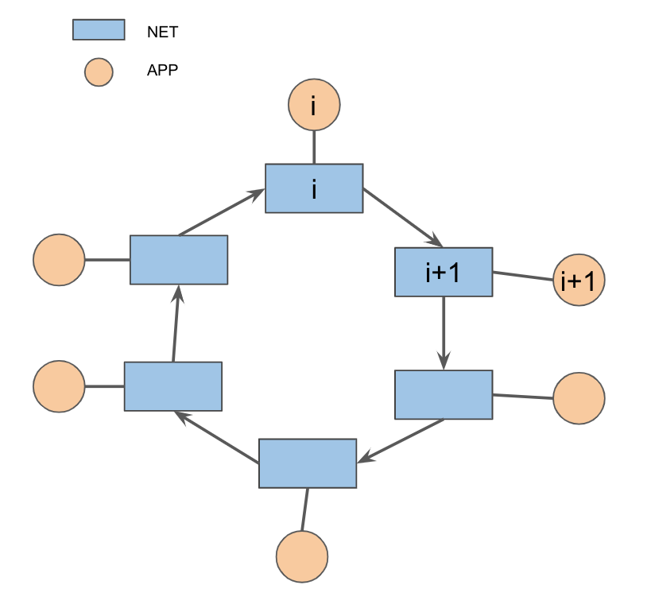

## Scénario

Supposons une vente aux enchères, chaque site veut gagner la marchandise.

- `prix de la marchandise(Pm)`: donnée partagé entre tous les sites

Pour chaque site:
- `prix max(Pmax)`: le prix maximum qu'un site peut supporter. Ex:int aléatoire entre (60,80) 
- `prix ajouté(Pa)`: si c'est le tour de site i pour Augmenter les enchères et si la somme de Pm et Pa ne passe pas le Pmax, site i excute son tour.

## APP(i)

- en cas de reçu d'un message vient de NET(i) pour la synchronisation: mettre en synchronisation le Pm

- en cas de reçu d'un message vient de NET(i) pour le passage de droit: augementer les enchères

Note: 
1. après l'augementation les enchères, il faut synchroniser Pm, et puis passer le droit

2. idée à penser: ajouter des entêtes dans les messages envoyé à NET(i) pour identifier si le message est pour la synchronisation ou pour le passage de droit.

## NET(i)

- en cas de reçu d'un message et leurs traitements:
    - msg vient de APP(i) pour la synchronisation: renvoyer à tous les NET(j) [avec i!=j] pour synchroniser le Pm
    - msg vient de APP(i) pour le passage de droit: renvoyer à NET(i+1) pour le passage de droit
    - msg vient de NET(i-1) pour le passage de droit: renvoyer à APP(i) pour excuter l'augementation les enchères
    - msg vient de NET(j) [avec i!=j] pour la synchronisation: renvoyer à APP(i) pour synchroniser Pm

