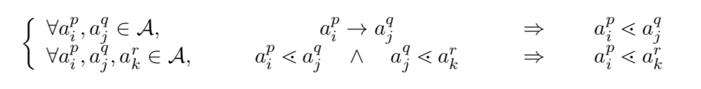
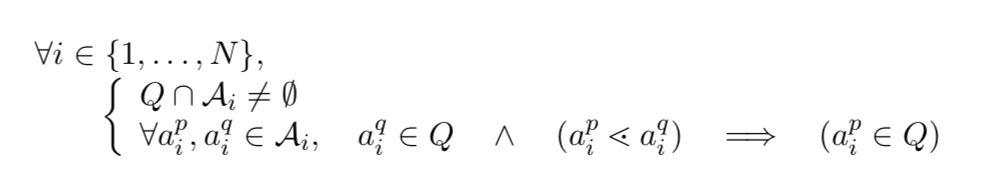
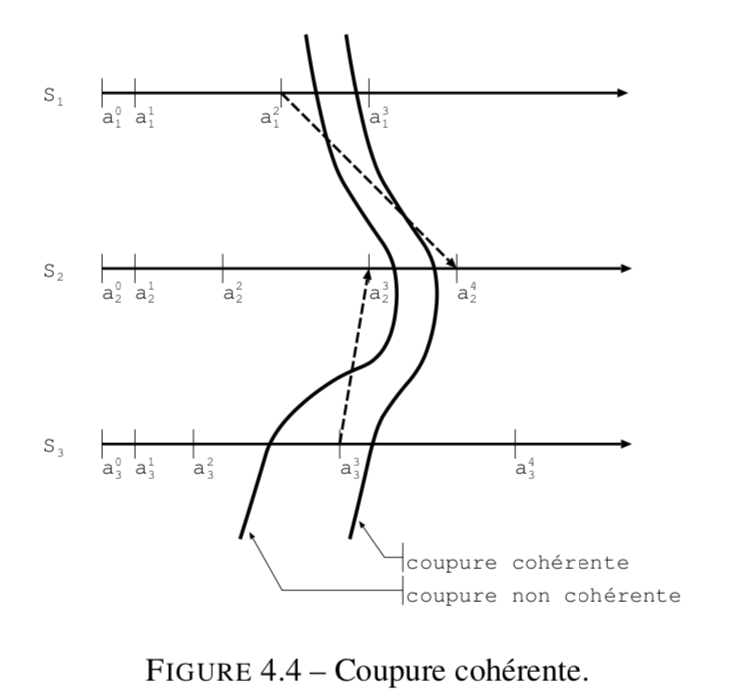
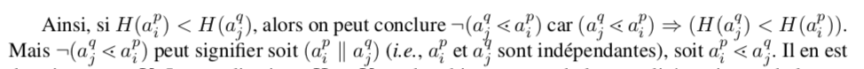

## Introduction

Définition: un réseau d'entité calculants, coopérant en s’échangeant de l’infor- mation afin de réaliser un but commun.
 
Objectif: donner à l'utilisateur une vue non distribué d'un environnement composé d'éléments répartie dans l'espace, et communicant les uns des autres.

#### Les critères pour différencier les système distribués
    
- nombre de sites connu ou non
- topologie connue ou non
- codes uniformes (identiques d’un nœud à un autre) ou non
- évolutions concertées (synchronisations) des sites ou non

Au niveau des communications:
- si le temps de délivrance d’un message est incertain ou bien fixé
- si l’ordre des messages sur un lien est connu ou aléatoire

On distingue généralement quatre paramètres essentiels : 
- la topologie du réseau
- la synchronisation des nœuds
- les pannes tolérées 
- le type de communications :uni-irectionnelle ou bi-directionnelles


Les paramètres quantitatifs:
- le diamètre du réseau
- sa bande passante
- sa latence
- la taille maximale d’un message

#### caractéristique importante d’un système distribué

- l'accès éventuel à une certaine connaissance globale du système distribué: 
    - horloge globale; 
    - numérotation des entités, 
    - état global pé- riodiquement distribué (synchronisation, terminaison, etc.)

`Système anonyme`匿名系统: Lorsqu’il n’y a pas moyen de distinguer deux nœuds quelconques grâce à un identifiant ou à un comportement (exécution) différent

- le mode de communication: 
    - mémoire partagée
    - registres
    - si les mémoires de réception (ou tampons) sont de taille finie ou non 
    - si les messages peuvent être désordonnés ou non (propriété FIFO)
    - si les communications ne sont pas effectuées en mode connecté

#### Particularités

并行编程`Programmation parallèle` & 并发编程`Programmation concurrente`

- `Programmation parallèle` : un ordinateur possédant plusieurs unités de calcul coopérant dans le but d’exécuter une tâche commune: MIMD
    des processus indépendants, ne pouvant communiquer que par envoi de messages 有同时处理多个任务的能力
- `Programmation concurrente`: dans un système d’exploitation multi-tâches, les proces- sus évoluent de façon autonome, et communiquent entre eux
    Le programmeur est alors confronté aux problèmes des synchronisations de processus, des interblocages, de l’exclusion mutuelle 有处理多个任务的能力，不一定要同时

- `Système séquentiel` : lorsqu’il n’est composé que d’une seule entité. On peut connaître aisément l’état dans lequel se trouve un tel système à un instant donné en suivant son exécution pas à pas. Il existe une relation d’ordre totale entre deux actions.

- `Système centralisé`: lorsqu’il est composé de plusieurs entités commu- niquantes ne pouvant fonctionner qu’en faisant référence à un site particulier, investi d’un rôle plus important que les autres.
    - Avantages:    
        - plus facile d’ordonner les actions 
        - plus facile de connaître l’état global du système
    - Inconvénient: 
        - pas une bonne idée dans un système géographiquement réparti
        - la remise en route de l’ensemble du système serait subordonnée à une intervention sur le site privilégié

- `Système réparti`:  est composé de plusieurs entités calculantes identiques (il n’y a pas de site privilégié)
    - l’indétermination des temps de traitement et de communication ne permet pas de connaître préci- sément l’état du système
    - si l’état du système était connu à un instant donné, l’état suivant ne peut être déduit

#### Problématiques des systèmes distribués
- La coordination de sites distants les uns des autres
- l’exploration d’un réseau
- la centralisation d’une information ne sont pas immédiates
- L’état du système peut évoluer au cours de ces tâches que l’on aurait voulu « atomiques »
- comment partager un médium de communication à accès unique entre plusieurs sites
- Comment élire un site coordonnateur 
- l’utilisation de ressources partagées entre les sites nécessite des algorithmes répartis d’allo- cation, d’exclusion mutuelle, de gestion des interblocages
- la tolérance aux défaillances (perte de messages, panne d’un site...)
- l’instabilité de la topologie: extensibilité

## CH2 - Modélisation d’un système réparti

### graphes

- `distance`:  est **la plus petite longueur** de toutes les chaînes reliant u à v

- `diamètre`:est **la plus grande distance** séparant deux sommets de G

-  La `composante connexe` d’un sommet u est **le plus grand ensemble** de sommets v re- liés à u par une chaîne

- Dans un graphe orienté, la `composante fortement connexe` d’un sommet u est **le plus grand ensemble** de sommets v tel qu’il existe un chemin de u à v et un chemin de v à u, augmenté du sommet u lui-même.

- Le `degré entrant` d’un sommet v d’un graphe orienté est le nombre d’arcs **arrivant** en v. 

- Le `degré sortant` de v est le nombre d’arcs **partant** de v.

- Un `graphe partiel ou graphe couvrant` est un sous-graphe d’un graphe G(V, E)

- Un graphe non orienté G(V,E) est `complet` s’il existe une arête entre toute paire de sommets

- Un graphe orienté `complet` est tel qu’il existe un arc de u à v, pour tous sommets u et v de V (et donc également un arc de v à u)


- Une `étoile` est un arbre de hauteur 1

- Un `anneau` est un graphe composé d’un seul cycle élémen- taire

- Un `cycle hamiltonien` d’un graphe G(V,E) est un graphe partiel de G en forme de cycle élémentaire : c’est un cycle de G qui passe une et une seule fois par tous les sommets de G

-  Un `cycle eulérien` est un cycle de G qui passe une et une seule fois par toutes les arêtes de G (il peut passer plusieurs fois par le même sommet)

### Modéliser les calculs et les communications

#### Modélisation des calculs : processus

- `le modèle des processus`: le calcul réparti est exprimé par l’exécution concurrente de processus séquentiels

    - recouvre la plus petite entité capable de pro- duire une activité
    - séquentiels: il ne comporte qu’un seul flux de contrôle

    - Le processus est muni d’une structure de contrôle lui permettant d’attendre après différentes conditions et de déclencher une action spécifique lorsque l’une des conditions est remplie

Autres modélisations: les réseaux de Pétri, les automates, ou des modélisations matricielles

#### Modélisation des communications : messages

les communications inter-processus

- `le modèle du passage de messages` : un processus envoie une information à un autre en ajoutant un message dans sa queue de réception. Ce destinataire réceptionne le message en le retirant de sa queue, et en le traitant

    Cette hypothèse distingue les systèmes distribués des systèmes parallèles 

- `Communications par variables partagées`: Les systèmes concurrents tels que les processus d’un système d’exploitation communiquent généralement par l’intermédiaire de variables globales partagées, accessibles en lecture et écriture par les processus

- `Communications par registres`: Une forme plus faible de variables partagées consiste à partager des variables locales aux processus, et uniquement avec certains de leurs voisins

#### Actions gardées

Le code d’un processus est constitué de conditions, et d’actions à exécuter lorsque ces conditions sont remplies. Une façon commode d’écrire un tel code est celle dite des `actions gardées`.


- les `gardes de communication` : concernent l’arrivée ou le départ d’un message:(lignes 1 et 3)
- les `gardes internes` : portent sur des conditions internes au site :(lignes 5)
- les `gardes externes` : liées à des événements externes au système :(lignes 7)

### Principaux paramètres
- Topologie du réseau
- Communications
- Processus
#### Topologie du réseau

- communication bi-directionnels: la topologie à travers un graphe non orienté G(V,E)
-  communications unidirectionnelles: un graphe orienté


- Influence de la topologie
    - techniques de diffusion
    - tolérance aux défaillances
    - complexité

#### Communications

- `communication par la queue`
    -  un délai entre l’envoi et la réception du message
    - La capacité d’un lien de communication correspond à la taille de la queue

- `communication par rendez-vous`: l’émetteur attend que le destinataire soit prêt avant de lui transmettre un message

- Dans le cas des communications par registres, la capacité des liens est égale à un (car un seul message peut être momentanément stocké par le lien)

- `délai de délivrance`: Lorsqu’un message est émis dans un canal de communication, il est reçu après un délai

#### Processus

- Un système distribué est `uniforme` si les codes locaux de chacun des processus sont identiques

- Si un processus seulement a un code différent des autres, le système est dit `semi-uniforme`.

- Si tous les codes sont différents, le système est `non uniforme`

- S’il n’y a aucun moyen de distinguer les processus, on dit que le système est `anonyme`

- `code uniforme` & `exécution uniforme`(même comportement d’un site à l’autre)

### Synchronisation
- Un système est dit `synchrone` si son fonctionnement est organisé en phases globale

- un système est `asynchrone` s’il ne présente pas de telles synchronisations

- Une `communication est synchrone` si l’envoi et la réception sont bloquantes: émetteur et récepteur sont bloqués jusqu’à ce qu’ils puissent faire la communication ensemble

- Dans une `communication asynchrone`, l’envoi n’est pas bloquant. Le temps de délivrance du mes- sage est arbitraire, mais fini

- `réseau asynchrone à délai borné`

- Notons que si le receveur tombe en panne, l’émetteur est bloqué et le système ne fonctionne plus. Cette implémentation n’est donc pas très tolérante aux fautes

- `L’appel de procédure à distance` :[Remote Procedure Call (RPC)] Il est assez voisin du modèle `CSP(Communicating Sequential Processes)`. Il s’agit d’exécuter une procédure sur un site distant qui retournera le résultat

- `Actions atomiques`: une action qui ne peut être divisée en sous actions

- des limitations dans l’ordre des actions sont souvent introduites avec le concept de `démon`
    - `démon synchrone`: choisit simultanément tous les processus.
    - `démon réparti`: choisit d’activer simultanément un ensemble quelconque de processus
    - `démon totalement réparti`: choisit là-encore un sous-ensemble de processus, qui lisent, calculent, mais peuvent retarder la phase d’écriture, de sorte que les écritures peuvent avoir lieu après un nouveau choix du démon, et donc de nouvelles lectures.
    - `démon à lecture-écriture`: choisit un seul processus, et exécute soit une lecture suivie du calcul associé, soit une écriture du résultat

## CH3 - Étude d’un système réparti: la modélisation du comportement du système

- connecteurs logiques: 


- tables de vérité:真值表


- théorèmes du calcul propositionnel 命题逻辑 


### Formalisation du comportement

- `état` ou `configuration`
- `Changement d’état` ou `transition`
- `configuration initiale`
- `ensemble des exécutions`
- `configuration atteignable`

- Équité
    - `exécution faiblement équitable`: une exécution durant laquelle toute action continuellement exécutable finit par se réaliser.

    -  `exécution fortement équitable`: une exécution durant laquelle toute action infiniment souvent exécutable (mais pas forcément en continu) finit par se réaliser.
- Maximalité
    - `exécution maximale` une exécution qui est soit infinie, soit finie mais plus aucune action n’est possible
    
    Quand aucune règle n’est appliquable dans la présente configuration, celle-ci est appelée `configuration terminale`

    - Les algorithmes pour lesquelles chaque exécution contient une configuration terminale sont dits `silencieux`

#### Influence de la synchronisation et de l’atomicité

-  plus la synchronisation entre les processus est faible, et plus il y aura de configurations atteignables
- plus l’atomicité est faible, plus les configurations sont nombreuses

### Méthodes pour montrer la validité d’un algorithme

- `tâche dynamique`: définis par le comportement qu’ils doivent avoir 
    - ex: le passage d’un jeton sur un anneau
- `tâche statique` : caractérisés par les résultats qu’ils doivent construire
    - généralement silencieux : une fois que le résultat global est construit, ils s’arrêtent
    - ex: calculer une distance

#### Propriétés de sûreté

- `sûreté`: Une propriété exprimée sous la forme d’un prédicat P défini sur les configurations C du
système est dite **propriétés de sûreté** si elle est vérifiée pour toutes les configurations atteignables
   
- permet d’affirmer qu’un événement ou une situation dommageable pour le système ne se produira pas

- `Stabilité`: Une propriété P définie sur les configurations C du système est dite **stable** si elle se transmet par la relation de transition 

- `Invariance`: Une propriété P est dite **initialement vrai** si elle est vérifiée pour toutes les configurations initiales I :

#### Propriété de vivacité

-  Une propriété P est dite **propriété de vivacité** du système réparti si, pour toute exécution du système, il existe une configuration dans laquelle elle devient vraie

-  pour but de caractériser un changement d’état, c’est-à-dire la production d’un résultat par le système

- `Un ensemble ordonné (E, ≺)` est `bien fondé` lorsqu’il n’existe pas de suite décroissante infinie
    - ex:  l’ensemble des entiers naturels N muni de la relation d’ordre habituelle < constitue un ensemble ordonné bien fondé

- Les propriétés d’équité permettent d’affaiblir la définition de la projection p

### Mesure de la complexité

- `Complexité en temps`
    - le temps de calcul et le temps aux échange de messages
    - système asynchrone: égale au délai séparant le débu et la fin de la plus grande séquence de messages consécutifs
    - système synchrone: mesurée en terme de nombre de phases globales nécessaires à son accomplissement
- `Complexité en mémoire`
    - égale à la plus grande capacité mémoire né- cessaire à un site pour fonctionner

- `Complexité en mémoire`
    - on compte le nombre total de messages émis lors d’une exécution (ou bien entre deux confi- gurations données pour les algorithmes non silencieux)
    - Ce résultat est généralement exprimé en fonction du nombre de nœud

## CH4 - Appréhender les exécutions réparties
les relations d’ordres, et les raisonnements sur les ensembles de configurations

- `Les relations d’ordre` sont des relations binaires (c’est-à-dire des relations définies sur des couples d’éléments), qui vérifient certaines propriétés.

- une action ne peut avoir lieu avant elle-même:` des relations d’ordre strict`

- `treillis`: Un treillis est un ensemble T muni de deux lois de composition interne et qui vérifient les axiomes suivants, pour tout a, b et c éléments de T:


- `élément maximum` & `élément maximal`


- un élément qui est plus grand que tous les éléments d’un sous-ensemble est dit `majorant de l’ensemble`

### Relation de causalité

- La définition d’une `observation` revient à établir un ordre total sur les actions du système 

- Une `observation est valide` si elle peut correspondre à ce que pourrait noter un observateur extérieur au système


- `Relation de précédence`


- Lorque la relation de précédence ne contient pas de cycle, elle peut être étendue par transitivité en une `relation d’ordre stricte` : 



- Deux actions a et b sont dites `non comparables`, et on note `a||b`, si elles sont différentes et si l’une n’est pas la cause de l’autre 


- Dans un système distribué, les actions indépendantes ou concomitantes ne sont pas comparables.

- la relation de causalité n’est pas suffisante pour établir une observation

- Si deux actions concomitantes surviennent, cet observateur peut les noter dans l’ordre qu’il veut

### Coupure

- `état global` : correspond à une photographie globale du système

- si l’on veut que `l’état global soit cohérent`, alors la réunion des photographies locales doit donner l’illusion d’une photographie globale

- `Coupure`


- exemple d'un coupure:


- exercice 75


- `frontière`: un sous-ensemble de Q constitué sur chaque site de l’action la plus récente inclue dans la coupure.
    - `Le passé de la frontière` est constitué des actions ayant eu lieu avant (au sens causal) celles de la frontière. 
    - `Le futur de la frontière` est constitué des actions ayant lieu causalement après la frontière.


- `Coupure cohérente` définition:
    - Les coupures cohérentes permettent de définir une relation d’ordre partiel entre les états globaux cohérents.






- `Historique`
    - si l’historique d’une action définit une coupure, alors celle-ci serait cohérente.
    - ’historique d’une action est vide si, et seulement si, il s’agit d’une action d’initialisation.


- `Historique complémenté`: pour les actions dont l’historique est non nul, ce qui exclut les actions d’initiali- sation
    - L’historique complémenté est utilisé dans **la construction des horloges vectorielles**


## CH5 - Horloges logiques

### Horloge entière
- `L’horloge logique entière` date toute action avec une valeur entière supérieure à celle de toutes les actions qui la précèdent au sens de la causalité
   


- exercices 85:


- L’application H permet d’ordonner les actions par une relation d’ordre stricte


- L’horloge logique entière ne permet pas d’obtenir une unique observation car l’ordre qu’elle induit sur les actions n’est pas total.

### Estampilles 印记/戳


- Relation d'ordre


- l'ordre strict total K


### Horloges vectorielles

- Les applications H et K rendent bien compte de la causalité, mais pas de `la non causalité` : il est impossible de dire si deux actions sont concomittantes ou non



- Certaines applications auront besoin d’une horloge logique qui fournisse `un ordre compatible` avec la relation de causalité, mais qui rende également compte de `l’indépendance de deux actions`.

 


- Les horloges vectorielles ne permettent pas de construire une unique observation.

- Mais en contrepartie, elles renferment une information plus riche sur l’exécution que les horloges H et K

- exerceice 117


## CH6 - Constructions d’instantanés

-  `action de clic`: l’action au cours de laquelle les sites prennent leur instantané local, c’est-à- dire leur photographie locale.
    - Les actions qui précèdent la prise de l’instantané sont appelées `préclic`
    - Les actions qui succèdent la prise de l’instantané sont appelées `postclic`
    - Un message envoyé sur Si avant son instantané et reçu sur Sj après son instantané est appelé message `prépost`
    - Un message envoyé sur Si après son instantané et reçu sur Sj avant son instantané est appelé message `postpré`
    - les messages `prépré` sont envoyés et reçus avant les actions de clic
    - les messages `postpost` sont envoyés et reçus après les actions de clic


-  `étati`l’état du site Si au moment où celui-ci prend l’instantané
- L’état global `étatG` associé à l’instantané est défini par la réunion des états locaux étati


-  `l’état du canal` entre les sites Si et Sj par l’ensemble des messages émis par Si et non encore reçus par Sj.

- On dira que l’instantané est `cohérent` si la configuration associée correspond à celle obtenue après une coupure cohérente, ce qui revient à dire qu’il n’y a pas de messages postpré


#### Algorithme avec marqueur
    - R1 : tout site Si est initialement blanc et devient définitivement rouge lors de la prise de l’ins- tantané ;
    - R2 : les messages envoyés par un site rouge sont rouges et ceux envoyés par un site blanc sont blancs ;
    - R3 : tout site finira rouge ;
    - R4 : un site blanc ne recevra pas de messages rouge.
    - R5 : un site qui devient rouge envoie un message appelé marqueur à ses voisins ; 
    - R6 : la réception du marqueur entraîne le passage de l’état blanc à rouge ;
    - R7 : les communications sont FIFO ;
    - R8 : au moins un site devient rouge.


#### Algorithme d’instantané avec lestage
    - construit un instantané malgré la présence de canaux non FIFO.
    - n’utilise pas de messages de contrôle tels que les marqueurs pour diffuser l’information «l’instantané global a commencé».


#### Algorithme d’instantané avec reconstitution de configuration

- Collecter les états locaux, ainsi que les messages préposts

- On considère un réseau connexe non FIFO de N sites. On suppose que ces N sites peuvent s’échanger des messages le long d’un anneau de contrôle, et que l’initiateur sait qu’il y a N sites dans le réseau.

- L’anneau de contrôle est orienté, et passe une seule fois par chacun des sites (circuit hamiltonien 哈密顿)

- VERSION 1:
    - Collecter les états locaux


- VERSION 2:
    - Collecter les états locaux ET les messages préposts

 

- - VERSION 3:
    - Collecter les états locaux ET les messages préposts
    - intègre une condition de terminaison ne portant que sur le nombre d’états reçus.
    -  l’initiateur collecte le nombre global de messages prépost en transit.


- VERSION FINALE:
    - Modifier la condition de terminaison de telle sorte que l’algorithme s’arrête une fois que l’initiateur a reçu tous les états et tous les messages préposts.
    -  La condition de terminaison devient : «les N − 1 états attendus ont été reçus et NbM- sgAttendus messages préposts ont été reçus par l’initiateur». Cette condition peut être remplie soit à l’arrivée d’un état, soit à l’arrivée d’un message prépost. Le test de terminaison est donc présent à deux endroits dans le programme


## CH8 - Exploration de réseaux

- De façon informelle, un algorithme réparti d’exploration de réseau est lancé par un (ou plusieurs) site(s) du réseau, qu’on appelle initiateur. Après une initialisation interne, ces sites envoient des messages à leurs voisins. À la réception d’un message, ceux-ci effectuent un calcul local, et émettent à leur tour des messages (après une initialisation interne dans le cas du premier message). Cette cascade de calculs locaux définit ce qu’on appellera une `demi-vague`

- Si la demi-vague se réfléchit depuis les derniers sites atteints jusqu’aux initiateurs, on parle de `vague`

- Mais il n’est pas toujours utile que le retour se fasse vers l’initiateur quand un autre site pourrait faire l’affaire. On utilise alors des `ondes`

- Les algorithmes d’explorations
    - silencieux
    - besoin de la connaissance du voisinage
    - possible d’explorer des systèmes anonymes


### demi-vague
1. l’algorithme est silencieux ;
2. un site Si, appelé initiateur, admet une action spontanée notée aˇi et appelée action de demi- vague de Si ; mis à part cette action, aucune autre action n’est spontanée, hormis les actions d’initialisation des variables, qui n’engendrent aucune communication ;
3. tout site Sj autre que l’initiateur admet au moins une action causalement postérieure à l’action de demi-vague aˇi de l’initiateur Si dans le réseau ; on note aˇj la plus ancienne de ces actions, qui s’appelle action de demi-vague de Sj .


- la garde d’une action de demi-vague d’un site qui n’est pas l’initiateur est une réception
-  une demi-vague peut servir à diffuser une information détenue par l’initiateur
-  la `diffusion` est un cas particulier de la demi-vague

- l’hypothèse de connaissance du voisinage


### Arborescence


- on appelle `Ti` l’arborescence construite par la demi-vague lancée par l’initiateur Si


### Vague
4. pour tout site dans l’arborescence de diffusion Ti de l’initiateur Si, il existe une action de vague aˆj postérieure à l’action de demi-vague aˇj et postérieure à toutes les actions de vague aˆk des descendants Sk de Sj dans Ti.

- la `diffusion avec retour` est un cas particulier de la vague
    - Une diffusion détermine une arborescence, dite `arborescence de diffusion`

- Exercice 156


- Rv4 : lorsqu’un site reçoit un message bleu alors qu’il l’avait déjà reçu, il retourne à l’émetteur un message rouge ;
- Rv5 : lorsqu’un site a reçu un message rouge de chacun de ses voisins, il envoie un message rouge vers son parent.

- Diffusion avec retour:


#### `Parcours en profondeur`. 
- Le parcours en profondeur est l’un des parcours classiques d’un graphe, avec le parcours en largeur. Il permet notamment d’identifier les composantes fortement connexes.


#### Calcul d’une valeur dans un réseau


### Ondes

- Une onde comporte au moins un initiateur mais il peut y en avoir plusieurs 

- `décideur` un site qui effectue une action de décision

- les termes d’onde centralisée ou à `source unique` et d’onde décentralisée ou `sources multiples`

- Les conditions sur la topologie du réseau sont plus faibles que pour les vagues

- Ro1: si un site a un seul voisin, il lui envoie un message.
- Ro2: si un site a reçu un message de tous ses voisins sauf un, il envoie un message à ce dernier. 
- Ro3: si un site a reçu un message de tous ses voisins, il décide.


- exercice 181:


- Une onde inclut une demi-vague dans la phase de démarrage
- Une vague est un cas particulier d’onde
- une onde n’est pas forcément une vague car le décideur n’est pas
forcément l’initiateur

## CH9 - Élection

- utilisés pour désigner un initiateur avant une vague, une construction d’instantané, ou tout autre calcul réparti nécessitant un initiateur.

- l’intérêt de l’élection réside dans la suppression de la symétrie

- peuvent être utilisées dans des graphes quelconques avec des sites anonyme

- exercice 192:


- R1 : l’algorithme est uniforme ;
- R2 : aucun site n’est distingué par rapport aux autres et chaque site du réseau peut débuter
l’exécution ;
- R3 : l’algorithme est silencieux (il se termine) ;
- R4 : dans chaque configuration terminale, il existe un unique site dans l’état élu tandis que tous
les autres sont dans l’état perdu.


```
Exercice 193 : Quels peuvent être les inconvénients de travailler avec des identités ?

Solution : Pour travailler avec des identités, il faut évidement en disposer. Or, pour des raisons de sécurité, certains systèmes ne font pas confiance aux sites, et ne prennent donc pas en compte les identités qu’ils affichent. Dans de tels systèmes, l’élection basée sur les identités n’est pas possible, à moins d’affecter préalablement des identités aux sites.

Dans certains environnements sujets aux pannes, les identités pourraient être corrompues, lors- qu’elles ne sont pas codées « en dur » (e.g., agents pouvant subir des corruptions de données).

Enfin, il se peut qu’il soit plus avantageux de travailler sans les identités, notamment lorsque peu de sites sont impliqués. En effet, le format des identités est souvent long pour autoriser un très grand nombre de machines différentes (e.g., numéro de série...), et cela impacte la complexité mémoire et la taille des messages. 

```

- Les algorithmes d’élection non anonymes recherchent l’identité la plus petite (ou la plus grande)


### Élection sur un anneau orienté unidirectionnel

#### Élection par constitution de la liste des candidats:


#### Élection par calcul du minimum des candidats:

- VERSION 1:


- VERSION 2:


### Élection dans un réseau quelconque

- Par définition, un algorithme d’élection est décentralisé, c’est-à-dire qu’il ne suppose pas l’exis- tence d’un site particulier

- Pour rendre l’algorithme précédent décentralisé, il suffit de faire partir une vague depuis chaque site candidat. Lorsqu’un site reçoit plusieurs vagues, il choisit celle du candidat d’identité la plus petite. C’est la technique dite d’`extinction`


- L’`algorithme avec constitution de la liste des candidats` admets une `complexité en messages` de `O(N2)`. 

- Avec l’`algorithme de calcul de minimum`, cette complexité n’est atteinte que dans le pire cas, tandis que la complexité moyenne est en `O(Nlog(N))`.

- `la complexité en temps` de tous ces algorithmes est en `O(N)`.

## CH10 - Détection de terminaison

- Lorsque le système a atteint son but dans la configuration terminale, la terminaison est dite `propre`. Dans le cas contraire, le système est `bloqué`, suite à un interblocage (cf. chapitre 13), une panne, 

- Même lorsque la configuration terminale est atteinte, les sites n’en ont pas forcément conscience. On parle alors de terminaison `implicite`. La terminaison est `explicite` lorsque les sites en ont connaissance

- La terminaison se caractérise par une configuration du système dans laquelle : 
    - tous les sites sont passifs ;
    - aucun message n’est en transit.

- `message de réveil`: Initialement, aucun message n’est en transit, et tous les sites sont passifs. Puis certains sites sont «réveillés» par l’«extérieur»,

- Un site actif peut envoyer des messages vers d’autres sites, et ainsi les réveiller

- si la configuration terminale est atteinte, comment rendre explicite la terminaison ? On distingue donc deux types d’algorithmes silencieux : 
    - (i) les algorithmes dont la terminaison est explicite dès la configuration terminale, au moins pour un site
    - (ii) les algorithmes qui terminent sans que leur terminaison ne soit explicite. Pour ces derniers, on utilise un algorithme de contrôle (défini ci-après) chargé de détecter leur terminaison

### Algorithmes de contrôle

Un algorithme de contrôle se caractérise donc par le fait qu’il comporte des gardes du type «Demande d’émission d’un message» et «Réception d’un message de l’application de base»


Un algorithme de contrôle visant à détecter la terminaison d’une application répartie de base devra respecter les propriétés suivantes :

- non-interférence : il ne devra pas modifier l’exécution de l’application de base ;
- vivacité : si la terminaison se produit, alors elle sera détectée ;
- sûreté : si une terminaison est signalée, alors effectivement l’application de base est dans une configuration terminale.

### Détection centralisée

- calcul diffus
    - R1 : tous les sites sont initialement passifs.
    - R2 : aucun site passif ne peut devenir spontanément actif, sauf un appelé initiateur.
    - R3 : tout site actif peut devenir passif.
    - R4 : tout site actif peut envoyer un message à un voisin ; il incrémente alors sa variable bilan (qui est nulle au départ).
    - R5 : lorsqu’un site passif autre que l’initiateur reçoit un message, alors celui-ci est appelé «message de réveil». Le site prend pour parent l’émetteur du message et devient actif.
    - R6 : lorsque l’initiateur ou un site ayant un parent reçoit un message, il retourne un acquittement à l’émetteur.
    - R7 : lorsqu’un site reçoit un acquittement, il décrémente sa variable bilan.
    - R8 : lorsqu’un site qui a un parent est passif, et que sa variable bilan vaut 0, alors il envoie un
    acquittement à son parent.
    - R9 : lorsque l’initiateur, après avoir été actif, est passif, et que sa variable bilan vaut 0, l’application répartie est terminée.


### Détection répartie
- ce ne sont pas les voisins qui sont attendus, mais les accusés de réception

```
Comment un initiateur peut savoir que les arborescences initiées par d’autres initiateurs ont terminé ?

Solution : Cet initiateur peut utiliser une onde. Un site atteint par cette onde la fait progresser immédiatement s’il ne fait pas parti d’une arborescence. Sinon, il l’a fait progresser seulement lorsqu’il quitte l’arborescence.
```

### Jeton vecteur-sur un anneau hamiltonien


### Quatre compteurs

## CH12 - la gestion des ressources

- `ressource`: une ressource est une entité qui n’appartient pas exclusivement au site (elle est extérieure au site), mais qui lui est nécessaire pour achever son exécution
    - nature matérielle: une im- primante, un médium de communication tel qu’un bus Ethernet 
    - logicielle:  une donnée
    - contextuelle: une condition logique sur l’exécution, telle que l’arrivée d’un message

- `ressource centralisée ` :localisées sur un seul site: imprimante
- `ressource distribuée`:  réparties sur plusieurs sites: donnée répliquée

- Si, au cours de toutes les exécutions possibles d’un algorithme réparti, seul un site Si désire une ressource donnée, alors elle pourrait en définitive appartenir au site Si. Si tel n’est pas le cas, la ressource est dite `partagée`
- Si plusieurs sites ne peuvent utiliser simultanément une ressource partagée, alors elle est dite `à accès exclusif`.

```
Quel serait l’inconvénient de gérer ces méta-ressources avec des algorithmes d’exclusion mutuelle ?

Il est donc nécessaire d’autoriser l’allocation de plusieurs ressources à accès exclusif séparément, mais simultanément. Avec plusieurs ressources, l’allocation de ressources ne peut plus se contenter d’un algorithme d’exclusion mutuelle ; on utilise des algorithmes de type tenir et attendre67 : le site tient certaines ressources et attend après d’autres. Il faut alors éviter que les demandeurs ne se bloquent mutuellement, ce qui conduirait à un interblocage
```

### Algorithmes d’allocation
- `contrôleur de ressources`: garantir un bon partage des ressources matérielles

- Les sites envoient aux contrôleurs des demandes de réservation de ressources, qu’on appelle `requête`
- Les différentes requêtes émises par un site pour obtenir simultanément l’accès à plusieurs ressources peuvent être regroupées au sein d’une `transaction`

- Les `algorithmes d’allocation de ressources` sont chargés de coordonner les actions des contrôleurs sollicités par les requêtes des sites demandeurs

#### Propriétés des algorithmes d’allocation

- Problèmatique:
    - exclusion mutuelle; accès exclusif: centralisé/répartie
    - ordonnancement des requêtes
    - interblocages

- `sûreté`

```
Exercice 241 : Proposer une propriété de sûreté caractérisant l’accès exclusif aux ressources.

Solution : La propriété «dans la configuration actuelle, aucune ressource n’est accédée par plus d’un site» traduit l’accès exclusif aux ressources. Lorsque l’algorithme d’allocation est correct, c’est une propriété de sûreté car elle est vérifiée à chaque configuration de toutes les exécutions.
```

- `vivacité`

```
Exercice 242 : Proposer une propriété de vivacité caractérisant la progression de l’application.

Solution : La propriété «dans la configuration actuelle, au moins un site demandeur est servi» traduit la progression de l’application : au moins un site était demandeur, et peut maintenant utiliser les ressources qu’il demandait. En les utilisant, il ne sera plus demandeur. C’est une propriété de vivacité car elle est fausse au départ, mais devient vrai ultérieurement dans l’exécution.

```

- la propriété de vivacité ne s’intéresse qu’à la pro- gression globale du système. Il est donc nécessaire d’ajouter `la propriété d’absence de famine`

```
Définir une propriété sur les exécutions traduisant l’absence de famine.

Solution : La propriété suivante définie sur les exécutions convient : dans la présente exécution e, pour toute configuration c ∈ e, et pour tout site Si demandeur dans la configuration c, il existe une configuration c′ ∈ e postérieure à c dans laquelle Si n’est plus demandeur.

```

- `la propriété de non interférence.`: comme tout algorithme de contrôle, on souhaite que l’algorithme d’allocation ne vienne pas perturber l’exécution répartie de l’application de base sur laquelle il est greffé et à laquelle il doit rendre des services

- `Équité`: 
    - `équité des sites` : aucun site n’est avantagé par rapport à un autre dans l’attente des ressources ;
    – `équité des ressources` : aucune ressource n’est privilégiée par rapport aux autres ;
    – `équité des requêtes` : absence de critère de discrimination des requêtes, tels que le nombre de ressources demandées, la prévision de la charge de travail, 

- `Efficacité`:
    - temps d’attente maximum ;
    - temps d’attente moyen ;
    - nombre de requêtes exécutées simultanément (parallélisme) ;
    - nombre de messages de contrôle nécessaires.

### Attentes

- `Absence d’attente`. L’algorithme d’allocation de ressources le plus simple consiste à demander les différentes ressources, et à ne conserver les ressources obtenues que si toutes les ressources deman- dées ont été obtenues. Si l’une des ressources n’a pu être obtenue, alors toutes les ressources sont libérées. Cet ensemble de libérations est appelée `retour arrière`

- `Liste d’attente unique.`: une seule file d’attente et de servir les requêtes dans l’ordre d’arrivée

- `Listes d’attente par ressources`:
    - Il est donc nécessaire de gérer convenablement les différentes listes d’attente au niveau de chaque ressource.

- Les situations d’interblocage simples peuvent être caractérisées à l’aide d’un graphe orienté ap- pelé `graphe des attentes`. 

- Les sommets de ce graphe correspondent aux sites de l’application répartie.Un arc relie le site Si au site Sj si Si est en attente à cause de Sj (Sj ne répond pas a ̀Si,ou bien détient une ressource dont Si a besoin).

- `Contexte de type ET`:Dans ce contexte, un site a besoin de toutes les ressources qu’il sollicite

- `Contexte de type OU`: Dans ce contexte, un site attend après plusieurs ressources, mais pourrait se contenter d’une seule


```
Exercice 252 : Quelle structure faut-il détecter dans le graphe des attentes pour prévenir un interblocage dans un contexte de communication ?

Solution : Il faut détecter les composantes fortement connexes terminales de plus d’un sommet. Une composante fortement connexe terminale est telle qu’aucun de ses sommets n’admet de succes- seurs en dehors de ceux de la composante.

```

```
Exercice 256 : En l’absence de préemption, que se passe-t-il si toutes les requêtes qui ne peuvent être exécutées sans créer de circuit sont mises en attente ?

Solution : Supposons que les sites Si et Sj détiennent les ressources Rp et Rq respectivement, et qu’ils désirent les ressources Rq et Rp respectivement. Ces deux demandes ne peuvent être satisfaites. Si elles sont toutes les deux mises en attente, alors il se produit un interblocage.

```

```

Exercice 257 : Avec la méthode de préemption, que se passe-t-il si toute requête peut préempter une autre ?

Solution : Les requêtes préemptées seront de nouveau émises par leur site. Elles préempteront donc les requêtes qui viennent de leur voler les ressources. Il n’y a plus que des préemptions, et la vivacité n’est plus garantie.
```


Chaque message contient l’horloge de l’émetteur de manière à synchroniser les horloges logiques des sites. Une requête se traduit par autant de messages que de ressources voulues. Tous ces messages de contrôle transportent l’estampille de début de requête (figure 12.4). À la réception d’une requête, un contrôleur alloue sa ressource au demandeur si celle-ci était libre. Sinon, il compare l’estampille du demandeur avec celle de l’utilisateur actuel. 

## CH13 - Interblocages

Face aux interblocages, il existe deux approches :
- `les techniques pessimistes` : elles consistent à modifier l’application répartie de telle sorte que
les interblocages ne puissent plus se produire.
    - `Les techniques d’évitement`: Elles consistent à analyser avant l’exécution l’ensemble des requêtes et à rechercher l’ordre d’exécution qui ne conduira pas à un interblocage. 
    - `Les techniques de prévention`: ellesajoutentuncontrôle pour éviter l’apparition des interblocages.

- `les techniques optimistes` : l’application répartie n’est pas modifiée, mais on lui greffe un algorithme de contrôle qui détecte et supprime l’interblocage, lorsqu’il survient.
    - `L’«algorithme de l’autruche»`: il consiste à ne rien faire pour supprimer l’interblocage
    - `la techniques de détection` : elles consistent à détecter la présence d’interblocage pendant l’exécution répartie.Il s’agit de repérer les attentes circulaires à l’aide de messages particuliers, ou en réalisant un instantané

### Prévention des interblocages

Lorsqu’une requête arrive à un contrôleur de ressources, celui-ci a trois choix possibles : 
- `réponse positive` : allocation de la ressource ;
- `réponse positive retardée` : mise en attente de la requête ;
- `réponse négative` : rejet de la requête.


```
Exercice 269 : Montrer sur un exemple que le fait de choisir le site qui a attendu le plus (i.e., file d’attente FIFO) peut conduire à un interblocage.

Solution : Considérons la situation de la figure 13.2. Il y a interblocage si les contrôleurs des ressources Rp et Rq allouent leur ressource à la première requête reçue lorsque le site Sk les libère.
```


```
Exercice 270 : Considérons la figure 13.2. En l’absence de préemption, quelle politique de ges- tion de la file d’attente permet de retrouver la situation que l’on obtiendrait si le site resté en attente avait émis sa requête après que les ressources aient été ré-allouées ?

Solution : En l’absence de préemption, si le contrôleur choisit le site en attente qui est le moins prioritaire (i.e., Sj ), alors on a la même situation que celle obtenue si Si avait émis sa requête après l’attribution des ressources à Sj (cf. figure 13.4). En effet, Si étant prioritaire, il aurait été mis en attente. Dans le cas contraire, Sj n’aurait pas été mis en attente.

```


```
Exercice 271 : Même question avec la préemption.

Solution : Avec préemption, si le contrôleur choisit le site en attente qui est le plus prioritaire (i.e., Si), alors on a la même situation que celle obtenue si Sj avait émis sa requête après l’attribution des ressources à Si (cf. figure 13.5). En effet, Sj n’étant pas prioritaire, il aurait été mis en attente. Dans le cas contraire, Si aurait volé les ressources à Sj .

```


#### Algorithme attendre ou mourir

- Cette technique d’allocation n’utilise pas la préemption. Elle est basée sur les priorités dyna- miques des requêtes, fournies par les estampilles.

- on ne met en attente le demandeur que si la ressource a été préalablement réservée pour une requête moins prioritaire

#### Algorithme blesser ou attendre

- Cette technique d’allocation utilise la préemption, et les priorités dynamiques des requêtes, four- nies par les estampilles.


### Détection des interblocages

- consiste à intervenir a posteriori : le sys- tème n’est pas modifié et en cas d’attente on vérifie qu’il ne s’agit pas d’un interblocage

```
Exercice 281 : En déduire une technique de détection.

Solution : On peut utiliser un algorithme de calcul d’instantané.
```


- On greffe donc un premier algorithme à l’application de base qui construit l’instantané, et recons- titue la configuration associée. 
- Puis un second algorithme de contrôle simule l’exécution de l’appli- cation de base pour vérifier qu’elle n’est pas bloquée par un interblocage


## CH14 - Exclusion mutuelle

- Dans un algorithme d’exclusion mutuelle réparti, les sites peuvent prendre trois états différents.
    - `état repos`: Au départ, tous les sites sont dans l’état repos
    - `état demandeur`: chaque site peut passer de l’état repos à l’état demandeur
    - `état satisfait`: Après gestion des conflits, un seul site à la fois peut atteindre l’état satisfait

```
Exercice 285 : Définir les propriétés de sûreté et de vivacité pour le problème de l’exclusion mutuelle.

Solution : On a :

- sûreté : pour toute exécution e, pour toute configuration c de e, il y a au plus un site dans l’état
satisfait ;

- vivacité : pour toute exécution e, pour tout site se trouvant dans l’état demandeur à la configu-
ration c, il existe une configuration c′ atteignable depuis c dans laquelle le site se trouve dans l’état satisfait.

```

- Les critères suivants sont les plus souvent utilisés pour comparer les algorithmes d’exclusion mutuelle entre eux :
    - nombre de messages émis pour chaque entrée en section critique ;
    - nombre de messages émis entre la sortie de section critique par un site et l’entrée d’un autre site en section critique (appelé `délai de synchronisation`) ;
    - délai d’attente entre l’émission de la requête demandant l’entrée en section critique et l’entrée effective du site émetteur (appelé `temps de réponse`).

### Exclusion mutuelle avec jeton
### Exclusion mutuelle avec des permissions

- Exclusion mutuelle avec des permissions individuelles


### File d’attente répartie

#### Solution répartie


